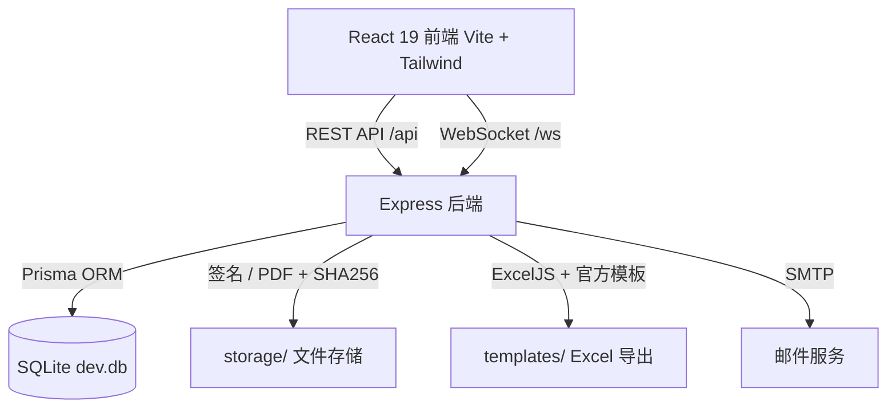

# HQU-CEAS

> 华侨大学计算机科学与技术学院 · 综合素质测评、奖学金与荣誉称号申报管理系统
>
> HQU Comprehensive Evaluation & Awards System (CEAS) for the College of Computer Science and Technology, Huaqiao University.

[](https://nodejs.org/)
[](https://www.typescriptlang.org/)
[](https://react.dev/)
[](https://vitejs.dev/)
[](https://expressjs.com/)
[](https://www.prisma.io/)
[](https://www.sqlite.org/)

---

## 目录

- [项目简介](#项目简介)
- [TODOlist](#TODO)
- [核心特性](#核心特性)
- [系统角色](#系统角色)
- [技术栈](#技术栈)
- [系统架构](#系统架构)
- [目录结构](#目录结构)
- [快速开始](#快速开始)
- [一键启动(Windows)](#一键启动windows)
- [环境变量](#环境变量)
- [常用脚本](#常用脚本)
- [前端页面路由](#前端页面路由)
- [API 接口分组](#api-接口分组)
- [数据与文件](#数据与文件)
- [构建与部署](#构建与部署)
- [项目文档](#项目文档)
- [许可证](#许可证)

---

## 项目简介

HQU-CEAS(Comprehensive Evaluation & Awards System)是一套面向高校学院的**综合素质测评 + 奖学金/荣誉称号申报**一体化管理系统。它把原本依赖 Excel 表格人工汇总、线下签字、邮件往返的评测与申报流程,整合成一个带权限隔离、自动计算、在线签名、PDF 归档和实时协同的 Web 系统。

系统围绕三类真实业务角色构建:学院管理员、班级负责人(班长)、以及综测审核小组成员。各角色看到的数据与可执行的操作彼此隔离,确保权限边界清晰、流程可追溯。

详细的业务流程与评审规则见 [docs/BUSINESS.md](docs/BUSINESS.md),系统架构细节见 [docs/ARCHITECTURE.md](docs/ARCHITECTURE.md)。

## TODO

- [ ] 个人综测填写表德育分加分改为减分（excel和对应计算逻辑）
- [ ] 两系统的公共页面修复：邮件配置、邮件模板、邮件通知、操作日志（两系统日志分离），以及系统设置的页面路由问题
- [ ] 管理员默认关闭修改分数功能（防止误改），可自主选择打开
- [ ] 奖学金系统待添加名单导出功能（需上交由学术部保存的签字名单）
- 若今年《关于国家奖学金评定办法的完善方案》被部分采纳
  - [ ] 系统需添加完善方案中的算法

## 核心特性

- **综合素质测评**:德育、学业、创新、体育、美育、劳动、公益服务等多维度分数录入与自动汇总,加分项逐条登记。
- **成绩批量导入**:学业成绩、体测/体育课成绩、个人综测填写表等多来源 Excel 导入,带成功/失败明细日志。
- **奖学金与荣誉申报**:申报批次创建、候选条件校验、名额金额控制、确认项核对、协议签署、PDF 归档与审核反馈的完整闭环。
- **班级综测审核小组**:邀请链接 + 设备绑定登录,逐生勾核、在线签名,自动生成审核确认书 PDF。
- **在线签名与 PDF 归档**:手写/上传签名,自动生成带签名的申报协议与审核确认书,统一文件存储与 SHA256 校验。
- **模板化 Excel 导出**:基于官方附件模板(附件 2 / 附件 4 / 申报汇总表)填充数据导出,支持按年级打包。
- **邮件通知**:可配置 SMTP,基于模板批量发送班长账号与申报通知,带发送日志。
- **审计日志**:关键操作记录前后值快照,支持按模块、动作、学年班级检索。
- **实时协同**:基于 WebSocket 推送数据变更,班长端与审核成员端即时同步。

## 系统角色

| 角色 | 标识 | 主要职责 |
| --- | --- | --- |
| 学院管理员 | `admin` | 全局管理:年级班级、学年、学生、综测数据、申报审核、配额、模板、邮件、审计等 |
| 班级负责人 | `monitor` | 本班分数维护、综测审核小组管理、奖学金/荣誉称号申报提交、材料与签名 |
| 审核成员 | `reviewer` | 通过邀请链接进入,对本班综测分数逐生核对并签名 |

## 技术栈

| 层级 | 技术 |
| --- | --- |
| 前端 | React 19, TypeScript, Vite 7, Tailwind CSS 4 |
| 后端 | Node.js, Express 4, TypeScript, Prisma 6, SQLite |
| 文件处理 | ExcelJS, Multer, Archiver |
| 认证与安全 | JSON Web Token, bcryptjs, CORS |
| 实时通信 | WebSocket (ws) |
| 工程化 | npm workspaces 单仓库, concurrently, tsx |

## 系统架构

前后端分离的单仓库(monorepo)架构:前端通过 REST API 与 WebSocket 同后端通信,后端经 Prisma 访问 SQLite,签名与 PDF 文件统一落地到存储层并以 SHA256 校验。



## 目录结构

```text
HQU-CEAS/
├── packages/
│   ├── backend/                 # Express + Prisma 后端
│   │   ├── prisma/
│   │   │   ├── schema.prisma    # 数据模型(29 个模型)
│   │   │   ├── seed.ts          # 种子数据(默认管理员)
│   │   │   ├── dev.db           # SQLite 数据库(私有仓库,随仓库保存)
│   │   │   └── archive/         # 历史数据库归档
│   │   ├── src/
│   │   │   ├── config/          # 环境配置与业务规则常量
│   │   │   ├── middleware/      # JWT 认证、错误处理
│   │   │   ├── routes/          # REST 路由(29 组)
│   │   │   ├── services/        # 业务逻辑与测试
│   │   │   ├── utils/           # 计算、密码、令牌工具
│   │   │   ├── ws/              # WebSocket 服务
│   │   │   └── index.ts         # 应用入口
│   │   ├── storage/             # 运行期文件(签名、PDF,按年/月归档)
│   │   └── templates/           # 官方附件 Excel 导出模板
│   └── frontend/                # React + Vite 前端
│       ├── public/              # 静态资源(logo、字体、操作指南 PDF)
│       ├── src/
│       │   ├── components/      # 业务组件(按模块分目录)
│       │   ├── hooks/           # useAuth / usePageMeta / useScores
│       │   ├── lib/             # API 客户端、路由、鉴权、WebSocket
│       │   ├── routes/          # 页面级路由组件
│       │   ├── styles/          # 全局样式
│       │   ├── App.tsx          # 路由表
│       │   └── main.tsx         # 入口
│       └── index.html           # 单页应用入口
├── docs/
│   ├── ARCHITECTURE.md          # 架构说明
│   ├── BUSINESS.md              # 业务流程与评审规则
│   ├── reference/               # 学校官方文件(通知、办法、原始附件)
│   └── samples/                 # 导入/填写样例表格
├── scripts/
│   └── generate_guides.py       # 操作指南 PDF 生成脚本(XeLaTeX)
├── start.bat                    # Windows 一键启动(前后端 + Cloudflare Tunnel)
├── package.json                 # npm workspaces 根配置
└── README.md
```

## 快速开始

### 环境要求

- Node.js 18 及以上
- npm 9 及以上

### 安装与启动

```bash
git clone <repository-url>
cd HQU-CEAS
npm install

# 创建后端环境变量文件
cp packages/backend/.env.example packages/backend/.env

# 生成 Prisma Client
npm run db:generate

# 启动前后端开发服务
npm run dev
```

前端默认运行在 http://localhost:3000,后端默认监听 http://localhost:4000(健康检查 `/api/health`)。

> **说明**:本仓库为私有仓库,`packages/backend/prisma/dev.db` 随仓库携带真实业务数据,克隆后即可直接使用。
> 如需从零初始化一个空数据库,删除 `dev.db` 后执行 `npm run db:push && npm run db:seed`。

### 默认管理员账号(仅空库种子数据)

| 用户名 | 密码 |
| --- | --- |
| `admin` | `admin123` |

> 生产部署务必立即修改默认密码,并设置强随机的 `JWT_SECRET`。

## 一键启动(Windows)

双击或在终端运行根目录的 `start.bat`,脚本会:

1. 清理 3000 / 4000 端口上的旧进程;
2. 启动后端(`npm run dev:backend`)与前端(`npm run dev:frontend`);
3. 若安装了 `cloudflared`,启动 Cloudflare Tunnel 并把系统暴露到公网域名(日志写入 `.logs/cloudflared.log`);
4. 按任意键停止全部服务。

## 环境变量

后端环境变量模板见 `packages/backend/.env.example`:

| 变量 | 说明 | 示例 |
| --- | --- | --- |
| `DATABASE_URL` | Prisma 数据库连接串(相对 `schema.prisma` 所在目录) | `file:./dev.db` |
| `JWT_SECRET` | JWT 签名密钥(生产务必替换为强随机值) | `replace-with-a-long-random-secret` |
| `PORT` | 后端监听端口 | `4000` |
| `CORS_ORIGIN` | 允许跨域的前端来源 | `http://localhost:3000` |
| `UPLOAD_DIR` | 导入文件上传目录(可选) | `./uploads` |

## 常用脚本

根目录(npm workspaces):

| 命令 | 说明 |
| --- | --- |
| `npm run dev` | 同时启动前后端开发服务 |
| `npm run dev:backend` / `npm run dev:frontend` | 单独启动后端 / 前端 |
| `npm run build` | 构建后端(tsc)与前端(vite build) |
| `npm test` | 运行后端测试(node:test) |
| `npm run db:generate` | 生成 Prisma Client |
| `npm run db:push` | 将 schema 同步到数据库 |
| `npm run db:seed` | 写入种子数据 |
| `npm run db:migrate` | 开发环境创建并应用迁移 |
| `npm run db:studio` | 打开 Prisma Studio |

工具脚本:

| 命令 | 说明 |
| --- | --- |
| `python scripts/generate_guides.py` | 重新生成 `packages/frontend/public/guides/` 下的四份操作指南 PDF(需要 XeLaTeX) |

## 前端页面路由

单页应用,路由表定义于 `packages/frontend/src/App.tsx`:

| 路径 | 页面 | 主要使用角色 |
| --- | --- | --- |
| `/login` | 管理员 / 班长登录 | admin, monitor |
| `/review-login` | 审核成员邀请登录 | reviewer |
| `/review/scores` | 审核成员分数核对 | reviewer |
| `/entry` | 系统入口(双系统状态) | admin, monitor |
| `/dashboard` · `/monitor/dashboard` | 综测总览 / 班级看板 | admin / monitor |
| `/scores` · `/monitor/scores` | 综测分数管理 / 本班分数 | admin / monitor |
| `/monitor/score-review` | 班级综测审核小组管理 | monitor |
| `/students` | 学生管理 | admin |
| `/import` · `/export` | 综测数据导入 / 材料导出 | admin, monitor |
| `/accounts` | 账号管理 | admin |
| `/awards` · `/monitor/awards` | 奖学金申报 | admin / monitor |
| `/honors` · `/monitor/honors` | 荣誉称号申报 | admin / monitor |
| `/declaration-reviews` | 申报审核 | admin |
| `/declaration-import` · `/declaration-export` | 申报数据导入 / 导出 | admin |
| `/monitor/submissions` | 班级申报记录 | monitor |
| `/tags` | 标签视图 | admin |
| `/audit-logs` | 操作日志 | admin |
| `/accounts-mail` | 邮箱配置与发送 | admin |
| `/mail-templates` | 邮件模板 | admin |
| `/settings` | 系统设置 | admin |

## API 接口分组

REST 路由统一挂载在 `/api` 前缀下(见 `packages/backend/src/index.ts`):

| 路由前缀 | 模块 | 路由前缀 | 模块 |
| --- | --- | --- | --- |
| `/api/auth` | 登录认证 | `/api/honor-declarations` | 荣誉称号申报单 |
| `/api/users` | 用户管理 | `/api/declaration-supplements` | 申报补充信息 |
| `/api/grades` | 年级与班级 | `/api/declaration-reviews` | 申报审核 |
| `/api/students` | 学生管理 | `/api/score-review-groups` | 综测审核小组 |
| `/api/scores` | 综测分数 | `/api/score-review-invites` | 审核邀请与核对 |
| `/api/import` | 数据导入 | `/api/signatures` | 签名文件 |
| `/api/export` | 材料导出 | `/api/pdf-materials` | PDF 材料 |
| `/api/academic-years` | 学年管理 | `/api/tags` | 标签 |
| `/api/system` | 系统设置 | `/api/audit-logs` | 操作日志 |
| `/api/templates` | 模板下载 | `/api/mail` | 邮件发送 |
| `/api/external-awards` | 外部奖项 | `/api/mail/settings` | 邮箱设置 |
| `/api/award-quotas` | 奖学金名额 | `/api/mail/templates` | 邮件模板 |
| `/api/class-honors` | 先进班级 | `/api/mail/logs` | 邮件日志 |
| `/api/awards` | 奖学金申报 | `/api/health` | 健康检查 |
| `/api/award-declarations` | 奖学金申报单 | `/ws` | WebSocket |

## 数据与文件

- **数据库**:SQLite,位于 `packages/backend/prisma/dev.db`,由 `DATABASE_URL` 控制;29 个 Prisma 模型覆盖组织人员、成绩导入、申报、审核、文件签名、标签审计、邮件设置等业务域(明细见 [docs/ARCHITECTURE.md](docs/ARCHITECTURE.md))。
- **导出模板**:官方附件模板位于 `packages/backend/templates/`,导出附件 2 / 附件 4 / 申报汇总表时按模板填充。
- **运行期文件**:签名图片与生成的 PDF 存放在 `packages/backend/storage/`,按 `类型/年/月` 归档,数据库中以 SHA256 索引。
- **操作指南**:`packages/frontend/public/guides/` 下的四份 PDF 由 `scripts/generate_guides.py` 生成,前端页面内可直接打开。

## 构建与部署

```bash
npm run build                      # 后端 tsc 编译到 dist/,前端 vite 构建到 dist/
npm run start -w packages/backend  # 运行后端编译产物
```

部署要点:

- 设置强随机 `JWT_SECRET`,修改默认管理员密码;
- `CORS_ORIGIN` 配置为前端实际域名;
- 前端构建产物位于 `packages/frontend/dist/`,可由任意静态服务器或反向代理托管;
- 保证数据库文件与 `storage/` 目录可写;
- 日常演示 / 校内使用也可直接用 `start.bat` 以开发模式 + Cloudflare Tunnel 运行。

## 项目文档

| 文档 | 内容 |
| --- | --- |
| [docs/ARCHITECTURE.md](docs/ARCHITECTURE.md) | 架构说明:分层设计、模块清单、数据模型、文件存储、脚本与部署 |
| [docs/BUSINESS.md](docs/BUSINESS.md) | 业务流程与规则:综测流程、申报流程、分数组成、候选条件 |
| `docs/reference/` | 学校官方文件:评审通知、奖学金实施办法、荣誉称号授予办法、原始附件表 |
| `docs/samples/` | 样例表格:个人综测填写表、学生导入模板导出样例 |

## 许可证

本项目为华侨大学计算机科学与技术学院内部业务系统,存放于私有仓库,未附开源许可证。
