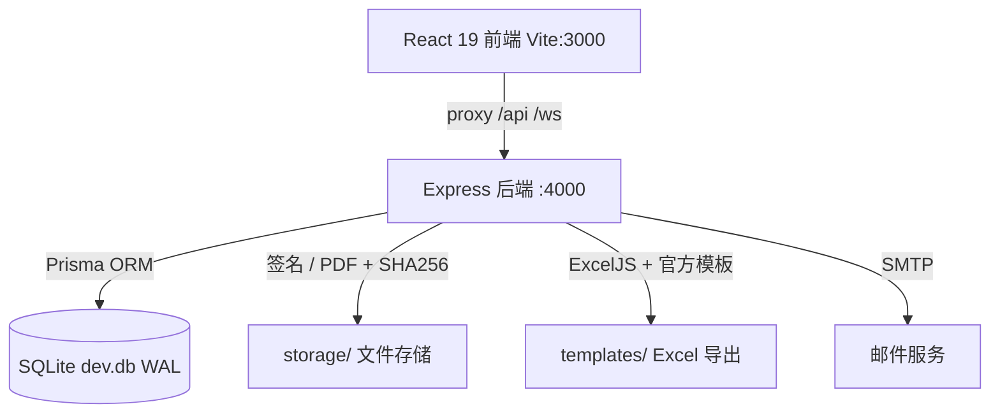

# HQU-CEAS

> **华侨大学计算机科学与技术学院 · 综合素质测评与评奖申报一体化管理系统(v2)**
>
> HQU Comprehensive Evaluation & Awards System — 把综测填报、班级审核签名、院级奖学金/荣誉称号申报、国家奖学金评定与官方附件导出,整合为一个带权限隔离、自动计算、在线签名、PDF 归档、审计留痕与实时协同的 Web 系统。

[](https://nodejs.org/)
[](https://www.typescriptlang.org/)
[](https://react.dev/)
[](https://vitejs.dev/)
[](https://expressjs.com/)
[](https://www.prisma.io/)
[](https://www.sqlite.org/)
[](#常用脚本)

---

## 目录

- [项目简介](#项目简介)
- [核心特性](#核心特性)
- [系统角色](#系统角色)
- [v2 亮点](#v2-亮点)
- [技术栈](#技术栈)
- [系统架构](#系统架构)
- [目录结构](#目录结构)
- [快速开始](#快速开始)
- [生产部署(公网)](#生产部署公网)
- [前端页面路由](#前端页面路由)
- [API 接口分组](#api-接口分组)
- [国家奖学金评定模块](#国家奖学金评定模块)
- [数据与文件](#数据与文件)
- [常用脚本](#常用脚本)
- [性能与高并发](#性能与高并发)
- [安全设计](#安全设计)
- [项目文档](#项目文档)
- [许可证](#许可证)

---

## 项目简介

HQU-CEAS 面向高校学院场景,替代"Excel 汇总 + 线下签字 + 邮件往返"的传统流程。**一套平台承载两个业务系统**,系统边界同时体现在前端路由、API 前缀与后端目录三处,新人看前缀即知身在何处:

| 系统 | 前端前缀 | API 前缀 | 覆盖业务 |
| --- | --- | --- | --- |
| 综合素质测评系统 | `/evaluation/*` | `/api/evaluation/*` | 分数录入/导入、自动汇总、班级审核小组、附件导出 |
| 奖学金与荣誉申报系统 | `/declaration/*` | `/api/declaration/*` | 院奖申报、荣誉称号、国家奖学金评定、申报审核与导出 |
| 平台(共用) | `/entry` `/accounts` … | `/api/platform/*` | 账号、组织、学年、邮件、审计、系统设置 |

首次使用请看 [docs/QUICKSTART.md](docs/QUICKSTART.md),或登录后进入站内「新手指引」(`/guide`)。

## 核心特性

- **综合素质测评**:德育、学业、创新、体育、美育、劳动、公益服务等多维度分数录入与自动汇总(体育总分/综测总分系统计算),加分/减分明细逐条登记。
- **成绩批量导入**:学业成绩、体测/体育课成绩、个人综测填写表等多来源 Excel 导入,带成功/失败明细日志与失败记录导出;导入链路事务化,批量写入原子生效。
- **班级综测审核小组**:邀请链接 + 设备绑定登录,审核成员逐生勾核、在线签名,自动生成审核确认书 PDF,进度经 WebSocket 实时同步到班长端。
- **奖学金与荣誉申报**:申报批次创建、候选条件自动校验、名额金额控制、确认项核对、班长在线签署协议、PDF 归档与管理员审核反馈的完整闭环。
- **国家奖学金评定**:平行班合组评定、候选池生成、班级效应上界估计、稳健占优分层与临界层结构化评议留痕(算法详见[下文](#国家奖学金评定模块))。
- **模板化 Excel 导出**:基于官方附件模板(附件 2/附件 4/申报汇总表/签字名单)填充导出,支持按年级打包 ZIP。
- **在线签名与 PDF 归档**:手写/上传签名,生成带签名的申报协议与审核确认书,统一文件存储与 SHA256 校验。
- **邮件通知**:可配置 SMTP(授权码加密存储),模板化批量发送班长账号与申报通知,带发送日志。
- **审计日志**:关键操作记录前后值快照,支持按模块、动作、学年班级检索,并按两系统分组过滤。
- **新手友好**:站内 `/guide` 角色化分步指引、首次登录引导横幅、关键页"下一步该做什么"式空状态提示。

## 系统角色

| 角色 | 标识 | 入口 | 主要职责 |
| --- | --- | --- | --- |
| 学院管理员 | `admin` | `/login` | 学年/年级/班级/学生/账号维护,成绩导入,综测总览,申报审核,国家奖学金评定,材料导出,邮件与审计 |
| 班级负责人(班长) | `monitor` | `/login` | 本班分数维护与明细登记,组建综测审核小组,奖学金/荣誉称号申报提交与签名 |
| 审核成员 | `reviewer` | 班长生成的邀请链接(`/review-login`) | 逐生核对本班综测分数与明细,在线签名;无需注册账号,设备绑定 |

## v2 亮点

- **双系统路由重设计**:前端 27 条懒加载路由、API 112 个业务端点按 `/platform`/`/evaluation`/`/declaration` 三前缀归位;**全部旧路径保留**(30 个 API 别名 + 16 条前端重定向),旧书签与旧脚本零断裂。
- **性能**:SQLite WAL 化、导入/重算事务化(批量导入由数百次串行写改为按学生原子事务)、导出 N+1 修复、gzip 压缩(实测 14.2KB → 1.5KB)、全路由代码分割(入口 chunk 约 10KB)。
- **公网安全基线**:JWT 密钥生产 fail-fast(杜绝默认密钥)、helmet 安全头、登录限流、全局限流、请求体积限制、单源生产部署。
- **文档体系重建**:8 篇文档按"第一次接触的人也能用"标准重写,端点级 API 新旧对照表齐全。
- 后端 76 个单元测试作为业务规则闸门,v1→v2 全程保持全绿。变更明细见 [docs/CHANGELOG-V2.md](docs/CHANGELOG-V2.md)。

## 技术栈

| 层级 | 技术 |
| --- | --- |
| 前端 | React 19、TypeScript、Vite 7、Tailwind CSS 4(全路由 React.lazy 代码分割) |
| 后端 | Node.js、Express 4、TypeScript、Prisma 6、SQLite(WAL) |
| 文件处理 | ExcelJS、Multer、Archiver |
| 认证与安全 | JSON Web Token、bcryptjs、helmet、express-rate-limit、compression |
| 实时通信 | WebSocket(ws) |
| 工程化 | npm workspaces 单仓库、tsx、node:test(76 用例) |

## 系统架构

**开发模式**(双进程,Vite 代理):



**生产模式**(单源部署,公网只暴露一个源):

```text
公网 ──▶ cloudflared ──▶ Express (4000, NODE_ENV=production)
                          ├── /api/*、/ws                    (业务接口)
                          └── frontend/dist 静态资源 + SPA fallback
                              (assets 一年 immutable 缓存,index.html no-cache)
```

后端分层固定为 `routes → services → prisma`:路由层只做参数解析与权限门禁,业务规则与数据访问在服务层,规则常量与纯函数在各模块 `rules/`。

## 目录结构

```text
HQU-CEAS/
├── packages/
│   ├── backend/                  # Express + Prisma 后端
│   │   ├── prisma/
│   │   │   ├── schema.prisma     # 数据模型(31 个模型)
│   │   │   ├── seed.ts           # 种子数据(默认管理员)
│   │   │   └── dev.db            # SQLite 干净种子库(仅默认管理员)
│   │   ├── src/
│   │   │   ├── server.ts         # 进程入口:监听 + WS + 优雅退出
│   │   │   ├── app.ts            # 组装:安全中间件→路由→别名→静态(生产)→错误处理
│   │   │   ├── core/             # 基础设施:config db cache ws middleware/ utils/
│   │   │   ├── modules/
│   │   │   │   ├── platform/     # 账号·组织·学年·设置·签名·PDF·审计·邮件
│   │   │   │   ├── evaluation/   # 分数·导入·模板·审核小组·综测导出(+scoreRules)
│   │   │   │   └── declaration/  # 奖学金·荣誉·国奖·申报审核·申报导出(+各规则)
│   │   │   └── types/            # 第三方类型补充
│   │   ├── storage/              # 运行期文件(签名、PDF,按年/月归档,不入库)
│   │   └── templates/            # 官方附件 Excel 导出模板(3 份)
│   └── frontend/                 # React + Vite 前端
│       ├── public/guides/        # 4 份角色操作指南 PDF
│       └── src/
│           ├── app/              # App.tsx(懒加载路由表+重定向)· AppShell · Sidebar · routes/
│           ├── features/         # evaluation/ declaration/ platform/ review/(按系统切片)
│           ├── components/ui/    # DataPanel ScreenState StatusChip Modal 等通用组件
│           ├── lib/              # api(新前缀) auth router validation ws
│           └── styles/
├── docs/                         # 项目文档(见「项目文档」)
├── scripts/                      # bench.mjs 压测工具 · generate_guides.py 指南生成
├── start.bat                     # Windows 一键启动(开发模式)
├── start-prod.bat                # Windows 生产模式启动(构建+单源+cloudflared)
└── README.md
```

## 快速开始

### 环境要求

- Node.js 18 及以上、npm 9 及以上

### 安装与启动

```bash
git clone <repository-url>
cd HQU-CEAS
npm install
npm run db:generate
npm run dev
```

前端 http://localhost:3000,后端 http://localhost:4000(健康检查 `GET /api/health`)。

> 仓库携带的 `packages/backend/prisma/dev.db` 为**干净种子库**,默认管理员 `admin / admin123`(登录后请立即修改密码);业务数据通过系统页面导入。需要重建空库:删除 `dev.db` 后执行 `npm run db:push && npm run db:seed`。
>
> 后端环境变量模板见 `packages/backend/.env.example`(开发模式可不配置;生产必须设置 `JWT_SECRET`)。

Windows 也可直接双击 `start.bat`(开发模式,含 cloudflared 隧道可选项)。

## 生产部署(公网)

```bash
npm run build        # 后端 tsc + 前端 vite 构建
npm run start:prod   # NODE_ENV=production 单源启动(需已构建)
```

或在 Windows 直接运行 **`start-prod.bat`**:检查 `JWT_SECRET`(未设置或为占位值将拒绝启动)→ 构建 → 单进程启动并健康检查 → cloudflared 指向 4000 单源。

- 生产模式由 Express 同源服务 API + WebSocket + 前端构建产物,不再对公网暴露 Vite dev server;
- `JWT_SECRET` 生成方式:`node -e "console.log(require('crypto').randomBytes(48).toString('hex'))"`;
- 完整清单(缓存策略、限流参数、容量边界、备份回滚、PostgreSQL 迁移路径)见 [docs/DEPLOYMENT.md](docs/DEPLOYMENT.md)。

## 前端页面路由

单页应用,路由表定义于 `packages/frontend/src/app/App.tsx`,全部懒加载;16 条 v1 旧路径自动重定向到新路径。

| 系统 | 路径 | 页面 | 角色 |
| --- | --- | --- | --- |
| 平台 | `/login` | 管理员/班长登录 | admin, monitor |
| 平台 | `/entry` | 系统入口(双系统开放状态) | admin, monitor |
| 平台 | `/guide` | 新手指引(角色化分步) | admin, monitor |
| 平台 | `/accounts` · `/accounts-mail` · `/mail-templates` | 账号管理 · 邮箱配置 · 邮件模板 | admin |
| 平台 | `/audit-logs` · `/settings` | 操作日志 · 系统设置 | admin |
| 综测 | `/evaluation/dashboard` · `/evaluation/scores` · `/evaluation/students` | 综测总览 · 分数管理 · 学生管理 | admin |
| 综测 | `/evaluation/import` · `/evaluation/export` | 数据导入 · 附件导出 | admin, monitor |
| 综测 | `/evaluation/class/dashboard` · `/evaluation/class/scores` · `/evaluation/class/review` | 本班总览 · 本班综测 · 审核小组确认 | monitor |
| 申报 | `/declaration/reviews` · `/declaration/national-scholarship` | 申报审核 · 国家奖学金评定 | admin |
| 申报 | `/declaration/import` · `/declaration/export` · `/declaration/tags` | 申报数据导入 · 材料导出 · 标签视图 | admin(导入含 monitor) |
| 申报 | `/declaration/class/awards` · `/declaration/class/honors` · `/declaration/class/submissions` | 奖学金申报 · 荣誉称号 · 提交记录 | monitor |
| 审核 | `/review-login` · `/review/scores` | 邀请登录 · 分数核对签名 | reviewer |

## API 接口分组

REST 统一挂载在 `/api` 下,按三前缀归位;**全部 v1 旧前缀保留为 deprecated 别名**。端点级明细(方法/权限/新旧对照)见 [docs/API.md](docs/API.md)。

| 新前缀 | 资源 |
| --- | --- |
| `/api/platform/*` | auth · users · grades · students · academic-years · system · signatures · pdf-materials · audit-logs · mail(+settings/templates/logs) |
| `/api/evaluation/*` | scores · import · templates · score-review-groups · score-review-invites · export(附件 2/4、年级 ZIP、失败记录、账号清单) |
| `/api/declaration/*` | external-awards · award-quotas · class-honors · awards · award-declarations · honors · honor-declarations · declaration-supplements · declaration-reviews · national-scholarships · tags · export(申报汇总、院奖分配、荣誉明细、申报附件 2、签字名单、邮件记录) |
| `/api/health` | 健康检查(status/timestamp/version/uptime) |
| `/ws` | WebSocket(按班级房间 + 管理员审计频道) |

## 国家奖学金评定模块

落实《关于国家奖学金评定办法的完善方案》附录 A,解决"同专业平行班按行政班切分名额导致更优学生落选"的结构性问题。管理员在 `/declaration/national-scholarship` 完成全流程:

1. **评比单元(平行班合组)**:选定同年级同培养方案的平行班合并评定,录入名额 `Q`、入池比例 `p`、班级效应参数 `w`、`d`(系统按班名自动建议平行班);
2. **算法一 · 候选池**:班级推荐 ∨ 专业绩点前 `p` ∨ 专业综测前 `p` ∨ 重大成果 者入池(并列同名次);
3. **算法二 · 班级效应上界 `B`**:解析上界 `w·d` 与经验上界 `median|Δ(q)|`(班内百分位对齐)取小;
4. **算法三 · 稳健占优分层**:`gᵢ−gⱼ>B` 且 `zᵢ≥zⱼ` 判占优,得稳健层名次与临界层;
5. **算法四 · 临界层结构化评议**:逐人书面理由留痕、最终排序与入选,**不设分数兑换率**;
6. **导出候选人比较表**(表 A-1)作为公示与复核依据。

算法为纯函数实现(`modules/declaration/rules/nationalScholarshipRules.ts`),附单元测试(含方案原文算例);业务规则详见 [docs/BUSINESS.md](docs/BUSINESS.md)。

## 数据与文件

- **数据库**:SQLite(WAL 模式),31 个 Prisma 模型覆盖组织人员、成绩导入、申报、综测审核、国奖评定、文件签名、标签审计、邮件设置等业务域;
- **导出模板**:`packages/backend/templates/` 三份官方附件模板,导出时按模板填充;
- **运行期文件**:签名图片与生成的 PDF 存放于 `packages/backend/storage/`(按 `类型/年/月` 归档,DB 以 SHA256 索引,不入 git);
- **操作指南**:`packages/frontend/public/guides/` 四份角色 PDF(由 `scripts/generate_guides.py` 生成),站内可直接打开。

## 常用脚本

| 命令 | 说明 |
| --- | --- |
| `npm run dev` | 同时启动前后端开发服务(`dev:backend` / `dev:frontend` 可单起) |
| `npm run build` | 后端 tsc 编译 + 前端 vite 构建 |
| `npm run start:prod` | 构建并以生产模式单源启动 |
| `npm test` | 后端测试(node:test,76 用例,业务规则闸门) |
| `npm run bench` | 并发压测本地 API(p50/p95,仅限本地/授权环境) |
| `npm run db:generate` / `db:push` / `db:seed` / `db:studio` | Prisma Client 生成 / schema 同步 / 种子 / 可视化 |
| `python scripts/generate_guides.py` | 重新生成四份操作指南 PDF(需 XeLaTeX) |

## 性能与高并发

- SQLite 以 WAL 模式运行(`busy_timeout=5000`、`synchronous=NORMAL`),读写并发能力满足学院规模(千级用户、百级并发);
- 导入与分数重算全事务化,批量导入原子生效;导出链路消除 N+1 查询;热点接口进程内缓存;
- 响应 gzip 压缩 + 静态资源一年 immutable 缓存 + 前端按路由代码分割,公网弱网环境收益显著;
- 自带压测工具 `scripts/bench.mjs`;实测数据、容量边界与更大规模的 PostgreSQL 迁移路径见 [docs/DEPLOYMENT.md](docs/DEPLOYMENT.md)。

## 安全设计

- JWT 认证,角色三分(admin/monitor/reviewer),路由级权限门禁;**生产环境未设置 `JWT_SECRET` 直接拒绝启动**;
- 审核成员一次性邀请令牌(哈希存储)+ 首次访问设备绑定;
- helmet 安全头、登录限流 20 次/15 分钟/IP、全局限流 600 次/分钟/IP、请求体积限制(默认 2MB,导入接口 50MB);
- SMTP 授权码加密存储;关键操作审计留痕(前后值快照);上传与生成文件统一 SHA256 登记防篡改;
- 完整安全清单见 [docs/DEPLOYMENT.md](docs/DEPLOYMENT.md)。

## 项目文档

| 我想…… | 看这篇 |
| --- | --- |
| 第一次使用,按角色一步步走 | [docs/QUICKSTART.md](docs/QUICKSTART.md) |
| 查某个功能怎么用(完整手册) | [docs/USER_GUIDE.md](docs/USER_GUIDE.md) |
| 了解业务规则(评定条件、分数组成、国奖算法) | [docs/BUSINESS.md](docs/BUSINESS.md) |
| 了解系统架构(模块、路由总表、数据模型) | [docs/ARCHITECTURE.md](docs/ARCHITECTURE.md) |
| 查 API 端点与新旧路径对照 | [docs/API.md](docs/API.md) |
| 参与开发(目录约定、新增模块、测试) | [docs/DEVELOPMENT.md](docs/DEVELOPMENT.md) |
| 部署到本机/公网、性能调优、备份回滚 | [docs/DEPLOYMENT.md](docs/DEPLOYMENT.md) |
| 看 v1→v2 变了什么、旧书签/脚本怎么迁移 | [docs/CHANGELOG-V2.md](docs/CHANGELOG-V2.md) |
| 学校官方文件 / 样例表格 | `docs/reference/` · `docs/samples/` |

## 许可证

华侨大学计算机科学与技术学院内部业务系统,未附开源许可证;使用与二次开发请先联系维护者。
