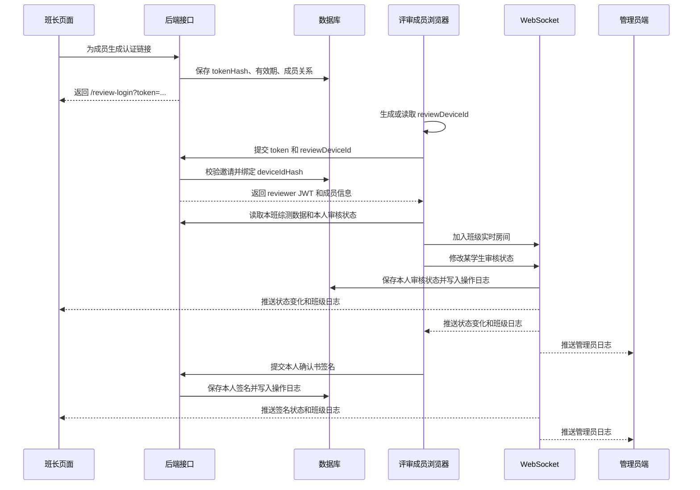

# feat: 综测评审小组成员邀请审核

## 一、背景与目标

当前综测审核页面已经支持班长维护评审小组成员、采集成员签名、查看并编辑本班综测数据。新增功能需要让班长为评审小组其余成员生成认证链接。成员打开链接后自动进入本班综测审核页面，只能查看综测数据，并且只能维护本人对每位学生的审核状态。

该设计的目标包括四项。

| 编号 | 目标 |
| --- | --- |
| G1 | 班长在现有综测审核页面添加评审小组成员姓名后，可以为每名成员生成专属认证链接。 |
| G2 | 成员打开链接后自动登录，并进入对应班级的综测审核页面。 |
| G3 | 成员页面只读展示综测数据，禁止修改分数、备注、成员名单、其余成员签名、导入、导出和总分计算。 |
| G4 | 成员可以实时维护本人对每位学生的审核状态，班长端和其余在线审核成员同步看到状态变化。 |
| G5 | 成员可以完成本人评审确认书签名，签名只能绑定本人评审成员记录。 |
| G6 | 邀请、登录、设备绑定、审核状态、签名等操作生成日志；班级页面实时显示本班日志，管理员端同步显示全部日志。 |

## 二、功能边界

评审成员拥有的写入能力限于本人审核状态、本人状态说明和本人评审确认书签名。

| 数据类型 | 评审成员权限 |
| --- | --- |
| 学生综测分数 | 只读 |
| 分数备注 | 只读 |
| 综测总分和排序 | 只读 |
| 评审小组成员名单 | 只读 |
| 评审确认书签名 | 可维护本人签名，只读其余成员签名 |
| 导入、导出、模板下载 | 无入口，无后端权限 |
| 本人对学生的审核状态 | 可维护 |
| 本人审核状态说明 | 可维护 |
| 班级内部操作日志 | 只读本班日志 |

审核状态属于新增业务数据，和综测分数分离存储。成员修改审核状态时，学生综测分数本身保持不变。

评审确认书签名复用现有 `SignatureFile` 和 `ScoreReviewGroupMember.signatureFileId` 字段。评审成员只能写入本人 `reviewMemberId` 对应的签名，不允许覆盖其余成员签名。

操作日志复用现有 `AuditLog` 模型，并补充班级范围字段。班长、评审成员在班级页面看到本班日志，管理员端看到全部综测评审相关日志。

## 三、现有代码依据

| 模块 | 现有文件 | 可复用内容 |
| --- | --- | --- |
| 鉴权 | `packages/backend/src/utils/token.ts`、`packages/backend/src/middleware/auth.ts` | 已有 JWT 生成与验证、班级权限检查。 |
| 评审小组 | `packages/backend/src/routes/scoreReviewGroups.ts`、`packages/backend/src/services/scoreReviewGroupService.ts` | 已有评审记录、成员名单、签名和确认书生成。 |
| 综测数据 | `packages/backend/src/routes/scores.ts`、`packages/backend/src/services/scoreService.ts` | 已有按班级读取综测分数、更新分数和计算总分能力。 |
| 实时通信 | `packages/backend/src/ws/index.ts`、`packages/frontend/src/lib/ws.ts` | 已有班级房间和分数同步事件。 |
| 班长页面 | `packages/frontend/src/components/scores/MonitorScoreReviewPage.tsx` | 已有成员管理、签名、综测表格入口。 |
| 前端认证 | `packages/frontend/src/lib/auth.ts`、`packages/frontend/src/App.tsx` | 已有本地 token 存储、用户对象和静态路由。 |
| 操作日志 | `packages/backend/src/services/auditService.ts`、`packages/backend/src/routes/auditLogs.ts`、`packages/frontend/src/routes/AuditLogsRoute.tsx` | 已有审计日志存储和管理员端查询页面。 |

现有 `monitorClassCheck` 只对班长的班级进行检查，未限定角色必须是 `monitor` 或 `admin`。新增 `reviewer` 角色前需要调整该中间件，保证评审成员无法进入班长接口。

## 四、核心设计

采用“邀请链接换取评审会话”的方式。链接本身是一次生成的随机凭证，数据库只保存凭证摘要。成员首次打开链接时，前端生成应用级设备号并发送给后端，后端将该设备号摘要绑定到邀请记录。后续同一链接只能由同一设备号继续访问。

浏览器环境无法读取真实硬件序列号，因此设备绑定采用应用级设备号。该设备号由前端使用 `crypto.randomUUID()` 生成，保存在 `localStorage`。清理浏览器数据或更换浏览器会导致设备号变化，此时原链接访问会被拒绝，需要班长刷新链接。

### 访问流程



## 五、数据模型设计

### 1. 评审邀请表

新增 `ScoreReviewMemberInvite`，用于保存每个评审成员的链接状态、设备绑定状态和登录信息。

| 字段 | 类型 | 说明 |
| --- | --- | --- |
| `id` | `Int` | 主键。 |
| `recordId` | `Int` | 对应 `ScoreReviewRecord.id`。 |
| `memberId` | `Int` | 对应 `ScoreReviewGroupMember.id`。 |
| `reviewerUserId` | `Int?` | 对应自动生成的 `reviewer` 账号，用于复用现有 JWT 鉴权。 |
| `tokenHash` | `String` | 认证链接 token 的 SHA-256 摘要，设置唯一索引。 |
| `deviceIdHash` | `String?` | 首次登录设备号摘要。为空表示尚未绑定设备。 |
| `deviceBoundAt` | `DateTime?` | 设备首次绑定时间。 |
| `status` | `String` | `active`、`revoked`、`expired`。 |
| `expiresAt` | `DateTime` | 链接过期时间，默认可采用综测开启期结束时间或生成后 7 天。 |
| `lastLoginAt` | `DateTime?` | 最近一次通过链接认证的时间。 |
| `createdBy` | `Int?` | 生成链接的班长用户编号。 |
| `createdAt` | `DateTime` | 创建时间。 |
| `updatedAt` | `DateTime` | 更新时间。 |

说明：采用 `reviewerUserId` 可以复用当前 `TokenPayload` 中的 `userId`、`username`、`role`、`classId` 字段，减少对 `/api/auth/me`、`api.ts`、WebSocket 鉴权的改动。该账号由系统自动生成，角色为 `reviewer`，密码为随机不可知内容，并且从账号管理列表中过滤。

### 2. 学生审核状态表

新增 `ScoreReviewStudentCheck`，用于保存每名评审成员对每名学生的审核状态。

| 字段 | 类型 | 说明 |
| --- | --- | --- |
| `id` | `Int` | 主键。 |
| `recordId` | `Int` | 对应 `ScoreReviewRecord.id`。 |
| `memberId` | `Int` | 对应 `ScoreReviewGroupMember.id`。 |
| `studentId` | `Int` | 对应 `Student.id`。 |
| `status` | `String` | `pending`、`reviewed`、`issue`。 |
| `remark` | `String?` | 有异议或补充说明。 |
| `checkedAt` | `DateTime?` | 状态变为 `reviewed` 或 `issue` 的时间。 |
| `updatedAt` | `DateTime` | 更新时间。 |

唯一约束使用 `recordId + memberId + studentId`，保证同一成员对同一学生只有一条审核状态。没有记录时按 `pending` 返回。

### 3. 签名与操作日志字段

评审确认书签名不新增业务表。成员签名使用现有 `SignatureFile` 存储图片，使用现有 `ScoreReviewGroupMember.signatureFileId`、`signedAt` 记录签名完成状态。后端保存签名前必须校验 `reviewMemberId` 与当前邀请会话一致。

操作日志使用现有 `AuditLog` 表，并在本次迁移中增加两个可选范围字段。

| 字段 | 类型 | 说明 |
| --- | --- | --- |
| `academicYearId` | `Int?` | 日志关联学年，用于管理员端筛选。 |
| `classId` | `Int?` | 日志关联班级，用于班级内部日志查询和实时推送。 |

日志内容仍使用 `module`、`action`、`actorId`、`targetType`、`targetId`、`beforeJson`、`afterJson` 保存。综测评审相关日志统一使用 `module = score_review`，班级内部页面只读取当前班级日志，管理员端读取全部日志。

### 4. 状态含义

| 状态 | 中文展示 | 含义 |
| --- | --- | --- |
| `pending` | 待审核 | 成员尚未确认该学生综测。 |
| `reviewed` | 已核对 | 成员确认该学生综测无误。 |
| `issue` | 有异议 | 成员发现该学生综测存在需要班长处理的问题。 |

班长端展示聚合状态时，规则如下。

| 聚合状态 | 计算规则 |
| --- | --- |
| 有异议 | 任一成员对该学生标记 `issue`。 |
| 已完成 | 所有有效成员均标记 `reviewed`。 |
| 待审核 | 其余情况。 |

## 六、认证与设备绑定

### 1. 链接生成

班长在评审小组成员列表中点击“生成审核链接”。后端为指定成员生成随机 token，并保存 token 摘要。返回给前端的完整链接形如：

```text
http://localhost:3000/review-login?token=<rawInviteToken>
```

链接原文只返回一次。刷新链接时，旧邀请记录状态改为 `revoked`，再生成新 token。

### 2. 自动登录

新增前端路由 `/review-login`。页面加载后读取地址中的 `token`，再读取或生成 `reviewDeviceId`，调用后端登录接口。

后端校验成功后返回普通 JWT。JWT payload 使用当前结构并扩展两个字段：

| 字段 | 说明 |
| --- | --- |
| `role` | 固定为 `reviewer`。 |
| `classId` | 该成员所属班级编号。 |
| `reviewInviteId` | 当前邀请记录编号。 |
| `reviewMemberId` | 当前评审成员编号。 |

前端保存 token 和用户信息后进入 `/review/scores`。

### 3. 设备绑定

后端收到 `deviceId` 后执行以下校验。

| 场景 | 处理方式 |
| --- | --- |
| 邀请记录不存在 | 返回 401。 |
| 邀请已撤销或已过期 | 返回 403。 |
| 首次登录且 `deviceIdHash` 为空 | 保存设备号摘要并允许登录。 |
| 已绑定设备且摘要一致 | 允许登录。 |
| 已绑定设备且摘要不一致 | 返回 403，并记录审计日志。 |

设备号只保存摘要。后端无需保存原始设备号。

## 七、后端接口设计

### 1. 班长侧邀请管理

| 方法 | 地址 | 权限 | 用途 |
| --- | --- | --- | --- |
| `GET` | `/api/score-review-invites/:classId` | `admin`、本班 `monitor` | 查看本班成员邀请状态。 |
| `POST` | `/api/score-review-invites/:classId/members/:memberId` | 本班 `monitor` | 为成员生成或刷新链接。 |
| `DELETE` | `/api/score-review-invites/:classId/members/:memberId` | 本班 `monitor` | 撤销成员链接。 |

返回字段包括成员编号、姓名、职务、链接状态、是否已绑定设备、最近登录时间、过期时间。完整链接只在生成或刷新接口中返回。

### 2. 评审成员认证和会话

| 方法 | 地址 | 权限 | 用途 |
| --- | --- | --- | --- |
| `POST` | `/api/score-review-invites/login` | 公开接口，需提交邀请 token | 校验链接、绑定设备、返回 reviewer JWT。 |
| `GET` | `/api/score-review-invites/session` | `reviewer` | 返回成员、班级、评审记录、综测数据、本人审核状态和聚合状态。 |
| `PUT` | `/api/score-review-invites/checks/:studentId` | `reviewer` | REST 备用方式，更新本人对单个学生的审核状态。 |
| `POST` | `/api/signatures` | `reviewer` | 保存绘制或上传的签名图片，仅允许 `purpose = score_review_confirmation`。 |
| `POST` | `/api/score-review-invites/signature` | `reviewer` | 将签名绑定到本人评审成员记录。 |

`session` 接口只允许返回当前邀请关联班级的数据。后端必须校验 `studentId` 属于当前 `classId`，避免构造编号访问其余班级学生。

### 3. 操作日志接口

| 方法 | 地址 | 权限 | 用途 |
| --- | --- | --- | --- |
| `GET` | `/api/score-review-invites/:classId/logs` | `admin`、本班 `monitor` | 查看本班综测评审操作日志。 |
| `GET` | `/api/score-review-invites/logs` | `reviewer` | 查看当前成员所在班级的综测评审操作日志。 |
| `GET` | `/api/audit-logs` | `admin` | 查看全部操作日志，并支持按 `module`、`classId`、`academicYearId` 筛选。 |

日志写入范围包括邀请链接生成、链接刷新、链接撤销、链接登录、设备首次绑定、设备不匹配拒绝、审核状态更新、本人签名提交、确认书生成。

### 4. WebSocket 事件

| 事件 | 方向 | 用途 |
| --- | --- | --- |
| `join:class` | 前端到后端 | 评审成员加入本人班级实时房间。 |
| `join:audit-admin` | 前端到后端 | 管理员端加入全量日志实时通道。 |
| `score-review:check:update` | 前端到后端 | 评审成员更新本人对某学生的审核状态。 |
| `score-review:check:updated` | 后端到发起方 | 状态保存成功回执。 |
| `score-review:check:sync` | 后端到班级房间 | 推送成员审核状态和聚合状态。 |
| `score-review:check:error` | 后端到发起方 | 状态保存失败。 |
| `score-review:signature:sync` | 后端到班级房间 | 推送成员签名完成状态。 |
| `score-review:log:sync` | 后端到班级房间 | 推送本班综测评审操作日志。 |
| `audit-log:sync` | 后端到管理员通道 | 推送全部综测评审操作日志。 |

`reviewer` 角色禁止发送 `score:update`。后端收到该事件时返回错误并拒绝保存。

## 八、前端页面设计

### 1. 班长综测审核页面

修改 `MonitorScoreReviewPage.tsx`，在评审小组成员列表中增加邀请管理区域。

| 元素 | 行为 |
| --- | --- |
| 生成审核链接 | 调用生成接口，返回链接后复制到剪贴板并展示一次。 |
| 刷新链接 | 撤销旧链接并生成新链接。 |
| 撤销链接 | 使旧链接无法继续换取会话。 |
| 绑定状态 | 展示“未绑定设备”或“已绑定设备”。 |
| 最近访问 | 展示成员最近通过链接登录的时间。 |
| 学生审核汇总 | 在综测表格旁展示每名学生的待审核、已完成、有异议状态。 |
| 班级操作日志 | 实时展示本班邀请、登录、设备绑定、审核状态和签名操作。 |

成员名单保存后，如果成员被删除，对应邀请和审核状态随成员删除或失效。

### 2. 评审成员登录页

新增 `ReviewInviteLoginRoute.tsx`，挂载到 `/review-login`。

页面职责包括读取 token、生成应用设备号、调用登录接口、保存认证信息、跳转到 `/review/scores`。认证失败时展示明确原因，例如“链接已过期”“该链接已绑定其余设备”“链接已撤销”。

### 3. 评审成员审核页

新增 `ReviewScoresRoute.tsx` 和 `ScoreReviewMemberPage.tsx`。

页面不使用完整管理侧边栏，只保留轻量页头、班级信息、成员姓名、本人签名区域、退出按钮、综测审核表格和班级操作日志。表格展示学生学号、姓名、各项综测分数、总分、分数备注和本人审核状态按钮。

| 控件 | 行为 |
| --- | --- |
| 本人签名 | 支持绘制或上传签名，保存后绑定本人评审成员记录。 |
| 待审核 | 将本人状态设为 `pending`。 |
| 已核对 | 将本人状态设为 `reviewed`。 |
| 有异议 | 将本人状态设为 `issue`，要求填写说明。 |
| 搜索 | 按学号或姓名筛选。 |
| 状态筛选 | 查看全部、待审核、已核对、有异议。 |
| 班级操作日志 | 实时展示本班综测评审相关操作。 |

评审成员页面不渲染分数输入框、不渲染备注编辑按钮、不渲染导入导出入口。

### 4. 管理员日志页面

修改管理员端操作日志页面。现有 `AuditLogsRoute.tsx` 继续承载全量日志查询，并增加综测评审日志实时更新。管理员端可按模块、学年、班级、操作类型筛选，实时看到各班邀请、登录、设备绑定、审核状态和签名操作。

## 九、权限设计

### 1. 角色权限

| 角色 | 允许访问 |
| --- | --- |
| `admin` | 保持现有管理权限。 |
| `monitor` | 保持本班综测填写、成员管理、签名和邀请链接管理权限。 |
| `reviewer` | 只允许访问评审成员认证、会话、本人审核状态更新、本人评审确认书签名、本班操作日志和本人班级 WebSocket 房间。 |

### 2. 后端校验要求

| 校验点 | 要求 |
| --- | --- |
| `monitorClassCheck` | 只允许 `admin` 和 `monitor` 进入，`reviewer` 一律拒绝。 |
| 分数更新 REST 接口 | `reviewer` 一律拒绝，同时校验班长只能更新本班学生。 |
| 分数更新 WebSocket 事件 | `reviewer` 一律拒绝，同时校验 `studentId` 属于当前房间班级。 |
| 评审状态更新 | 只允许当前 `reviewMemberId` 更新本人状态。 |
| 评审确认书签名 | 只允许当前 `reviewMemberId` 绑定本人签名文件。 |
| 学生编号 | 每次写入状态前校验学生属于当前评审记录班级。 |
| 邀请状态 | `revoked`、`expired` 或设备号不匹配时拒绝访问。 |
| 操作日志 | 班级页面只能读取当前 `classId` 日志，管理员端读取全部日志。 |

## 十、最少修改文件清单

### 后端

| 文件 | 修改方式 | 说明 |
| --- | --- | --- |
| `packages/backend/prisma/schema.prisma` | 修改 | 新增 `ScoreReviewMemberInvite`、`ScoreReviewStudentCheck`，为 `AuditLog` 增加 `academicYearId`、`classId`，并为 `User.role` 注释补充 `reviewer`。 |
| `packages/backend/src/utils/token.ts` | 修改 | `TokenPayload` 增加 `reviewInviteId`、`reviewMemberId` 可选字段。 |
| `packages/backend/src/middleware/auth.ts` | 修改 | 收紧 `monitorClassCheck`，新增 reviewer 专用会话校验中间件。 |
| `packages/backend/src/services/scoreReviewInviteService.ts` | 新增 | 负责链接生成、刷新、撤销、登录、设备绑定、状态读取、状态保存、本人签名绑定和班级日志读取。 |
| `packages/backend/src/routes/scoreReviewInvites.ts` | 新增 | 提供邀请管理、链接登录、会话读取、审核状态、本人签名和班级日志 REST 接口。 |
| `packages/backend/src/index.ts` | 修改 | 注册 `/api/score-review-invites` 路由。 |
| `packages/backend/src/routes/scores.ts` | 修改 | 禁止 `reviewer` 更新分数，补齐班级归属校验。 |
| `packages/backend/src/services/scoreService.ts` | 修改 | 增加学生班级归属校验辅助方法，供 REST 和 WebSocket 共用。 |
| `packages/backend/src/routes/signatures.ts` | 修改 | 允许 `reviewer` 保存本人确认书签名图片，并限制签名用途。 |
| `packages/backend/src/routes/auditLogs.ts` | 修改 | 管理员端支持按 `module`、`academicYearId`、`classId` 筛选日志。 |
| `packages/backend/src/ws/index.ts` | 修改 | 支持审核状态、签名状态、班级日志和管理员日志实时事件，禁止 `reviewer` 发送分数更新事件。 |
| `packages/backend/src/services/userService.ts` | 修改 | 账号列表中过滤系统生成的 `reviewer` 账号。 |
| `packages/backend/src/services/auditService.ts` | 修改 | 记录链接生成、刷新、撤销、登录、设备绑定、审核状态更新和本人签名，并带上班级范围字段。 |

### 前端

| 文件 | 修改方式 | 说明 |
| --- | --- | --- |
| `packages/frontend/src/lib/auth.ts` | 修改 | `User.role` 增加 `reviewer`，增加 `reviewMemberId`、`reviewMemberName` 可选字段。 |
| `packages/frontend/src/App.tsx` | 修改 | 增加 `/review-login`、`/review/scores` 两个路由。 |
| `packages/frontend/src/routes/ReviewInviteLoginRoute.tsx` | 新增 | 处理邀请链接自动登录。 |
| `packages/frontend/src/routes/ReviewScoresRoute.tsx` | 新增 | 评审成员审核页路由。 |
| `packages/frontend/src/components/scores/ScoreReviewMemberPage.tsx` | 新增 | 评审成员只读综测审核页面，包含本人签名和班级操作日志。 |
| `packages/frontend/src/components/scores/MonitorScoreReviewPage.tsx` | 修改 | 增加邀请链接管理、审核状态汇总、签名状态和班级操作日志展示。 |
| `packages/frontend/src/routes/AuditLogsRoute.tsx` | 修改 | 管理员端操作日志页面增加综测评审日志筛选和实时更新。 |
| `packages/frontend/src/components/audit/AuditLogsPage.tsx` | 修改 | 展示班级、学年、操作类型筛选项和实时日志追加。 |
| `packages/frontend/src/lib/ws.ts` | 修改 | 增加审核状态、签名状态、班级日志和管理员日志事件方法。 |
| `packages/frontend/src/lib/api.ts` | 复用 | 邀请登录接口使用现有请求封装。 |

## 十一、实施单元

- [ ] **单元一：数据库模型与 Prisma 迁移**

目标：新增邀请记录、逐学生审核状态存储，并为审计日志补充学年和班级范围字段。

涉及文件：`packages/backend/prisma/schema.prisma`，新增 Prisma migration。

验收标准：能够保存成员邀请、设备摘要、过期状态、每名成员对每名学生的审核状态，并能按班级读取综测评审操作日志。

- [ ] **单元二：后端邀请服务和路由**

目标：完成班长生成、刷新、撤销链接，评审成员自动登录、设备绑定、会话读取、本人签名绑定和班级日志读取。

涉及文件：`packages/backend/src/services/scoreReviewInviteService.ts`、`packages/backend/src/routes/scoreReviewInvites.ts`、`packages/backend/src/index.ts`。

验收标准：链接只返回一次；同一链接首次绑定设备；其余设备访问返回 403；过期或撤销链接无法登录；评审成员只能绑定本人确认书签名。

- [ ] **单元三：权限收紧和分数写入保护**

目标：确保 `reviewer` 只能进入评审成员专用能力，同时修补现有分数写入的班级归属校验。

涉及文件：`packages/backend/src/middleware/auth.ts`、`packages/backend/src/routes/scores.ts`、`packages/backend/src/services/scoreService.ts`、`packages/backend/src/ws/index.ts`。

验收标准：`reviewer` 无法调用分数更新、成员管理、签名、导入导出等接口；班长无法通过构造学生编号修改其余班级数据。

- [ ] **单元四：实时审核状态、签名状态和日志同步**

目标：通过 WebSocket 保存并广播成员审核状态，同步签名状态、班级操作日志和管理员端操作日志。

涉及文件：`packages/backend/src/ws/index.ts`、`packages/backend/src/services/scoreReviewInviteService.ts`、`packages/frontend/src/lib/ws.ts`。

验收标准：成员修改学生审核状态或提交本人签名后，班长端和同班在线评审成员同步更新；班级操作日志实时追加；管理员端实时看到全部综测评审日志；断线重连后通过会话接口获得最新状态。

- [ ] **单元五：班长端邀请管理界面**

目标：在现有综测审核页面中增加成员邀请链接管理、签名状态、审核汇总和班级操作日志。

涉及文件：`packages/frontend/src/components/scores/MonitorScoreReviewPage.tsx`。

验收标准：班长可以生成、复制、刷新、撤销链接；可以看到每个成员的绑定状态、最近访问时间、签名状态、每名学生的汇总审核状态和本班操作日志。

- [ ] **单元六：评审成员自动登录与只读审核页**

目标：完成 `/review-login` 自动登录和 `/review/scores` 只读审核页面，并支持本人签名和班级操作日志查看。

涉及文件：`packages/frontend/src/App.tsx`、`packages/frontend/src/routes/ReviewInviteLoginRoute.tsx`、`packages/frontend/src/routes/ReviewScoresRoute.tsx`、`packages/frontend/src/components/scores/ScoreReviewMemberPage.tsx`、`packages/frontend/src/lib/auth.ts`。

验收标准：成员打开链接后进入对应班级审核页面；页面无分数编辑、导入导出、成员维护入口；审核状态按钮可用；本人签名可保存；班级操作日志实时显示。

- [ ] **单元七：管理员端操作日志同步**

目标：管理员端操作日志页面展示并实时同步综测评审相关操作。

涉及文件：`packages/backend/src/routes/auditLogs.ts`、`packages/backend/src/services/auditService.ts`、`packages/backend/src/ws/index.ts`、`packages/frontend/src/routes/AuditLogsRoute.tsx`、`packages/frontend/src/components/audit/AuditLogsPage.tsx`、`packages/frontend/src/lib/ws.ts`。

验收标准：管理员可以按模块、学年、班级和操作类型筛选综测评审日志；班级内产生的新日志实时追加到管理员端；管理员端日志与班级内部日志来自同一条 `AuditLog` 记录。

## 十二、测试设计

### 后端测试

| 测试文件 | 覆盖内容 |
| --- | --- |
| `packages/backend/src/services/scoreReviewInviteService.test.ts` | 链接生成、摘要存储、设备绑定、设备不匹配拒绝、撤销、过期处理、本人签名绑定、班级日志读取。 |
| `packages/backend/src/services/scoreService.test.ts` | 学生班级归属校验，禁止跨班级写入分数。 |
| `packages/backend/src/services/auditService.test.ts` | 综测评审日志写入时带上 `academicYearId`、`classId`，管理员端和班级端读取同一条日志。 |
| `packages/backend/src/services/serviceBehavior.test.ts` | reviewer 角色被限制在评审专用能力内。 |

### 前端测试

当前前端未建立测试文件。实施时至少通过手工验证以下场景，后续如补充测试框架，再为新页面增加组件测试。

| 场景 | 期望行为 |
| --- | --- |
| 评审链接首次打开 | 自动登录并进入对应班级页面。 |
| 同一浏览器再次打开 | 允许进入审核页面。 |
| 另一设备或另一浏览器打开 | 提示链接已绑定其余设备。 |
| 成员点击“已核对” | 当前学生状态变更并实时同步给班长端。 |
| 成员点击“有异议” | 要求填写说明，保存后同步给班长端。 |
| 成员提交本人签名 | 签名状态同步给班长端，并生成班级操作日志。 |
| 班级内部操作日志 | 班长端和评审成员端实时看到本班新日志。 |
| 管理员操作日志 | 管理员端实时看到全部班级的综测评审日志，并可按班级筛选。 |
| 成员尝试访问 `/monitor/scores` | 后端拒绝班长接口数据。 |
| 成员尝试发送分数更新事件 | 后端拒绝并返回错误。 |

## 十三、注意事项

1. 链接 token 必须使用足够长的随机值，数据库只保存 SHA-256 摘要。
2. 完整链接只在生成或刷新时返回，页面刷新后只能重新生成。
3. 应用级设备号依赖浏览器本地存储。清理浏览器数据后，原链接会被视为新设备访问。
4. `reviewer` 账号由系统生成，不在账号管理页面展示，不提供人工密码登录入口。
5. 邀请撤销后，已签发 reviewer JWT 在过期前仍可能存在。因此 reviewer 专用中间件和 WebSocket 事件必须每次校验邀请状态。
6. 删除评审成员时，需要同步撤销其邀请，并清理或保留其历史审核状态。首期建议保留状态记录，接口返回时只统计当前有效成员。
7. 评审状态不参与综测总分计算，也不改变申报系统的数据来源。
8. 评审成员提交本人签名后，应复用现有确认书生成逻辑；所有有效成员签名完成后生成评审确认书 PDF。
9. 综测评审日志写入时必须携带 `academicYearId` 和 `classId`，班级内部日志和管理员端日志读取同一条审计记录。

## 十四、暂缓内容

| 内容 | 暂缓原因 |
| --- | --- |
| 多设备审批 | 当前需求要求同一链接绑定唯一设备。 |
| 真实硬件设备号 | 浏览器无法读取硬件序列号，应用级设备号更符合 Web 系统能力范围。 |
| 评审成员独立账号密码登录 | 当前需求以链接认证为主，账号密码会增加管理成本。 |
| 审核状态导出 | 当前需求聚焦在线审核，导出可在确认业务格式后另行设计。 |
