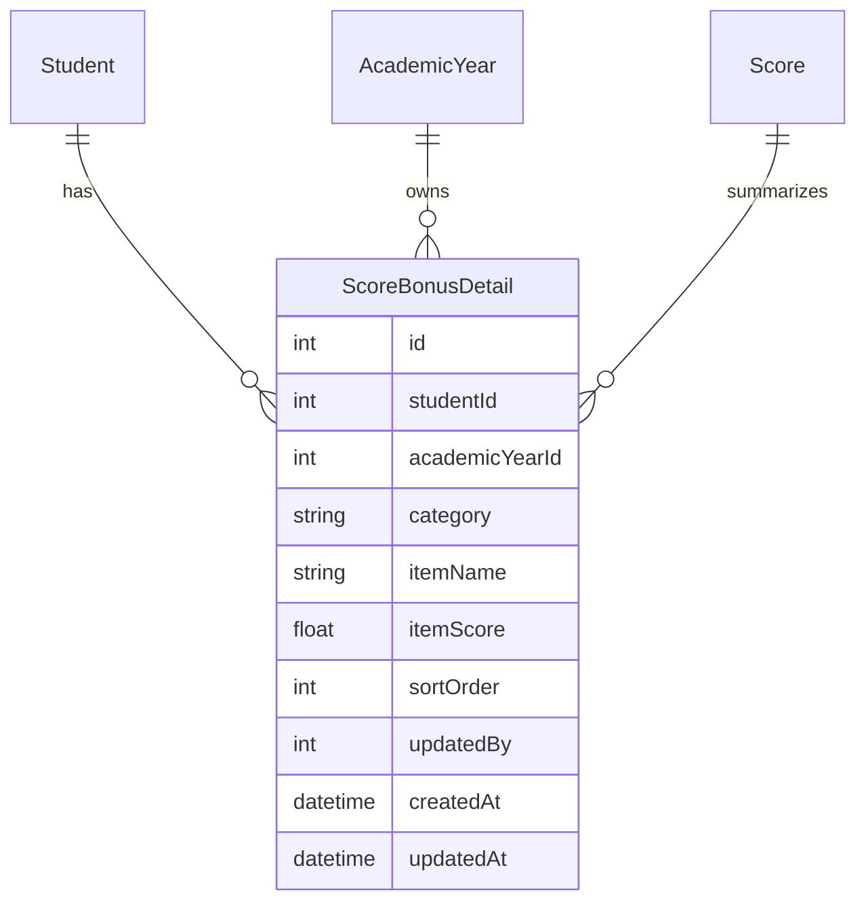

# 综测加分明细和个人填报模板改造修改方案

## 一、背景与目标

当前综测分数表中，每个可编辑分数字段右上角的小点会打开单段备注输入框。该备注只能保存一段文本，无法逐条记录加分事项和对应分数。个人综测填写表模板也把所有模块放在同一个工作表中，第 3 行填写分数，第 4 行填写备注，无法让学生按模块逐条填写加分内容。

本次改造目标如下。

| 编号 | 目标 |
| --- | --- |
| G1 | 分数字段右上角备注入口改为“加分明细”入口。 |
| G2 | 加分明细弹窗使用表格形式，一条记录一行，两列分别为“加分事项”和“加分分数”。 |
| G3 | 每个模块的总分由该模块加分明细的分数合计生成，减少总分和明细不一致。 |
| G4 | 个人综测填写表模板改为多工作表结构，每个模块单独一个工作表。 |
| G5 | 个人综测导入逻辑按模块工作表读取加分事项和加分分数，并写入系统加分明细。 |
| G6 | 班长端导入说明、模板下载、后端测试同步更新。 |
| G7 | 班级综测分数页面固定学号和姓名两列，横向滚动时分数列与学生身份列保持视觉分隔。 |
| G8 | 评审成员通过分享链接进入的审核页面重排为适合只读核对的页面结构。 |
| G9 | 社区表现分从综测分数页面移除，保留在奖学金和荣誉称号申报条件中使用。 |
| G10 | 体测成绩和体育课成绩只作为导入换算输入，系统只保存换算后的体育基础分。 |

## 二、功能边界

本方案处理学生自主填写的综测加分模块、综测表格展示、评审成员审核页展示、社区表现分展示归属和体育基础分导入换算。

| 模块 | 是否纳入明细 |
| --- | --- |
| 德育测评 | 纳入 |
| 创新与实践能力 | 纳入 |
| 体育奖励分 | 纳入 |
| 美育 | 纳入 |
| 劳动教育 | 纳入 |
| 公益服务与社会工作 | 纳入 |
| 附加分 | 纳入 |
| 学业学术素质 | 仍由成绩导入或规则计算 |
| 体测成绩、体育课成绩 | 仅作为体育基础分换算输入，导入后不保存为综测分数字段 |
| 体育基础分 | 由体育数据导入时按公式计算并保存 |
| 体育总分、总分 | 仍由系统计算 |
| 社区表现分 | 移出综测分数页面，供奖学金和荣誉称号申报判断使用 |

## 三、现有代码依据

| 位置 | 当前行为 |
| --- | --- |
| `packages/frontend/src/components/scores/ScoreEditor.tsx` | 右上角备注点打开单段 `textarea`，保存到 `Score.remark`。 |
| `packages/frontend/src/hooks/useScores.ts` | `updateRemark` 通过 WebSocket 调用 `score:update`，把备注文本和当前分数一起保存。 |
| `packages/backend/src/services/scoreService.ts` | `Score` 表保存 `value` 和 `remark`，更新分数后重算体育总分和总分。 |
| `packages/backend/src/services/templateService.ts` | `personal_forms` 模板需要按“学生信息 + 七个模块工作表”生成，模块页使用 15 行加分明细。 |
| `packages/backend/src/services/importService.ts` | `importPersonalForm` 按旧模板读取 B3 到 H3 分数、B4 到 H4 备注。 |
| `packages/frontend/src/components/import/ImportPage.tsx` | 个人综测导入说明仍写着 `B3-H3=各项分数, B4-H4=备注`。 |
| `packages/frontend/src/components/scores/ScoreEditor.tsx` | 学号列和姓名列使用 `sticky left-0`、`sticky left-[80px]`，但表格列宽没有固定，横向滚动时分数列会压到姓名列下方。 |
| `packages/frontend/src/components/scores/ScoreReviewMemberPage.tsx` | 评审成员页面左侧签名和日志占用大量高度，右侧审核表格仍按全量综测列渲染，移动端和较窄屏幕阅读压力较大。 |
| `packages/frontend/src/lib/validation.ts` | `SCORE_CATEGORIES_ORDER` 包含 `community`、`physical_test` 和 `pe_course`，综测表格会展示社区表现分和体育原始成绩。 |
| `packages/backend/src/config/scoreRules.ts` | 后端分数分类同样包含 `community`、`physical_test` 和 `pe_course`。 |
| `packages/backend/src/services/importService.ts` | `importSportsScores` 当前会保存 `physical_test`、`pe_course`、`community` 和 `sports_base`，需要改为只保存 `sports_base`，社区表现分改由申报数据域使用。 |

## 四、核心设计

新增结构化加分明细表，用一条明细表示某名学生在某学年、某个综测模块中的一个加分事项和对应分数。原有 `Score.value` 继续作为该模块最终分数，保存明细时由明细分数合计更新 `Score.value`，原有 `Score.remark` 可保留为兼容展示字段，但不再作为主要数据来源。

### 数据关系

说明：图中 `ScoreBonusDetail` 表示加分明细，`Score` 表继续保存模块合计分和参与总分计算。

## 五、数据模型设计

新增 `ScoreBonusDetail` 模型。

| 字段 | 类型 | 说明 |
| --- | --- | --- |
| `id` | `Int` | 主键。 |
| `studentId` | `Int` | 学生编号。 |
| `academicYearId` | `Int` | 学年编号。 |
| `category` | `String` | 综测模块，例如 `moral`、`innovation`。 |
| `itemName` | `String` | 加分事项。 |
| `itemScore` | `Float` | 加分分数。 |
| `sortOrder` | `Int` | 页面和 Excel 中的显示顺序。 |
| `updatedBy` | `Int?` | 最近维护人员。 |
| `createdAt` | `DateTime` | 创建时间。 |
| `updatedAt` | `DateTime` | 更新时间。 |

索引建议如下。

| 索引 | 用途 |
| --- | --- |
| `[studentId, academicYearId, category]` | 快速读取某个学生某个模块的明细。 |
| `[academicYearId, category]` | 批量导入后查询和统计。 |

历史备注处理规则：已有 `Score.remark` 中的文本在首次打开加分明细时可展示为只读提示；实施时可一次性转换为一条明细，事项名称为“原备注”，分数使用当前 `Score.value`。转换完成后，后续编辑以 `ScoreBonusDetail` 为准。

## 六、前端交互设计

### 1. 分数表格入口

可编辑模块的右上角小点保留，但含义从“备注”改为“加分明细”。如果该模块存在明细，小点保持高亮；如果不存在明细，仅在悬停时显示入口按钮。

入口点击后打开加分明细弹窗。

### 2. 加分明细弹窗

弹窗主体使用表格，字段如下。

| 列 | 输入类型 | 规则 |
| --- | --- | --- |
| 加分事项 | 文本输入 | 必填，建议限制 100 字以内。 |
| 加分分数 | 数字输入 | 必填，最小为 0，步长和该模块分数规则一致。 |

弹窗行为如下。

| 行为 | 说明 |
| --- | --- |
| 新增一行 | 在明细末尾增加空白行。 |
| 删除一行 | 删除当前加分事项。 |
| 保存 | 校验所有行后保存明细，并更新该模块总分。 |
| 取消 | 放弃本次编辑。 |
| 合计展示 | 弹窗底部展示当前明细合计和模块满分。 |

如果明细合计超过模块满分，前端阻止保存并展示错误提示。后端也必须重复校验。

### 3. 分数单元格展示

分数单元格仍展示模块总分。鼠标悬停或点击加分明细入口时，可以展示简短摘要，例如“3 条明细，合计 2.5 分”。详细事项只在弹窗中展示。

## 七、表格与审核页展示方案

### 1. 班级综测分数表固定列

班级综测分数表需要把学生身份列和分数列分成两个明确区域。学号列和姓名列继续使用粘性定位，但必须增加固定列宽、背景层级和右侧分隔线。

| 区域 | 方案 |
| --- | --- |
| 学号列 | 固定宽度 112px，`left: 0`，表头层级高于正文。 |
| 姓名列 | 固定宽度 96px，`left: 112px`，右侧增加分隔线和阴影。 |
| 分数列 | 每列固定宽度 96px，表格使用 `min-width: max-content`，横向滚动时只滚动分数区。 |
| 表头 | 学号、姓名固定列使用实体背景色，层级高于普通表头。 |
| 正文 | 固定列使用实体背景色，奇偶行背景由固定列同步继承，避免透明区域叠到分数列。 |

`ScoreEditor.tsx` 中目前姓名列使用 `left-[80px]`，该值小于实际学号列内容宽度，长学号场景会发生遮挡。修改时应使用常量或 CSS 变量统一控制列宽，例如 `--score-student-no-width: 112px` 和 `--score-name-width: 96px`。

### 2. 评审成员审核页重排

分享链接进入的审核页面只承担“查看综测、标记审核状态、提交本人签名、查看班级日志”四类任务。页面布局应以审核表格为主区域，签名和日志改为辅助区域，减少进入页面后先看到大块签名面板的情况。

| 区域 | 方案 |
| --- | --- |
| 顶部栏 | 显示班级、当前评审成员、已核对人数、有异议人数和退出按钮。 |
| 工具栏 | 放置搜索框、状态筛选、只看有异议开关和签名状态入口。 |
| 审核表格 | 作为首屏主体，使用和班级综测分数表一致的固定学号姓名列方案。 |
| 签名区域 | 改为右侧抽屉或弹窗，入口显示“确认书签名”，保存后顶部状态同步刷新。 |
| 班级日志 | 改为右侧抽屉或底部折叠面板，默认展示最近 5 条摘要，展开后查看完整记录。 |
| 移动端 | 表格区域横向滚动，状态按钮合并为下拉菜单，签名和日志使用全屏弹窗。 |

审核页中的分数列应复用综测展示列，不展示社区表现分、体测成绩和体育课成绩。评审成员只读查看加分明细摘要，不能编辑分数和明细。

### 3. 社区表现分展示归属

社区表现分属于奖学金和荣誉称号申报条件，综测分数页面无需展示。分类配置需要拆为“综测展示列”和“申报条件列”，避免一个 `SCORE_CATEGORIES_ORDER` 同时承担所有页面的列定义。

| 列表 | 包含内容 | 使用页面 |
| --- | --- | --- |
| `EVALUATION_SCORE_CATEGORIES_ORDER` | 德育测评、学业学术素质、创新与实践能力、体育基础分、体育奖励分、体育总分、美育、劳动教育、公益服务与社会工作、附加分、总分 | 班级综测分数页、评审成员审核页、综测审核确认书 |
| `DECLARATION_CONDITION_SCORE_CATEGORIES` | 学业学术素质、体测换算结果、社区表现分、总分、外部奖项标签、申报补充信息 | 奖学金申报、荣誉称号申报、附件 2 导出前校验 |

`community` 可以继续保存在申报数据相关模型中，也可以保留为后端分数分类中的管理字段，但综测接口返回给前端时应按页面用途过滤。奖学金和荣誉称号页面继续读取社区表现分，用于条件判断和导出材料。

### 4. 体育基础分导入换算

体测成绩和体育课成绩是体育基础分的换算输入，导入后无需在 `Score` 表保存 `physical_test` 和 `pe_course` 两个分类。体育导入保留输入校验和公式计算，只写入 `sports_base`，再触发 `sports_total` 和 `total` 重算。

| 年级阶段 | 换算规则 | 保存结果 |
| --- | --- | --- |
| 大一、大二 | `0.7 × 体测成绩 + 0.3 × 体育课成绩` | `sports_base` |
| 大三 | `体测成绩` | `sports_base` |

导入日志中可以记录本次导入文件名称、成功失败数量和失败原因，但不保存每名学生的体测原始分、体育课原始分。导入失败信息继续包含行号、学号、姓名和原因。

## 八、后端接口设计

新增或扩展接口如下。

| 方法 | 地址 | 权限 | 用途 |
| --- | --- | --- | --- |
| `GET` | `/api/scores/:studentId/:category/details` | 管理员、本班班长 | 读取某学生某模块加分明细。 |
| `PUT` | `/api/scores/:studentId/:category/details` | 管理员、本班班长 | 保存某学生某模块加分明细，并更新模块总分。 |

保存接口接收数据结构如下。

| 字段 | 说明 |
| --- | --- |
| `academicYearId` | 学年编号，缺省时使用当前学年。 |
| `items` | 加分明细数组。 |
| `items[].itemName` | 加分事项。 |
| `items[].itemScore` | 加分分数。 |

后端保存流程如下。

1. 校验操作者权限和学生班级归属。
2. 校验模块是否属于可明细化模块。
3. 校验每条分数是否符合模块步长、上限和非负要求。
4. 合计所有明细分数。
5. 用合计值更新 `Score.value`。
6. 替换该学生、该学年、该模块下的 `ScoreBonusDetail`。
7. 触发原有体育总分和总分重算。
8. 通过 WebSocket 同步分数和明细摘要。

## 九、个人综测填写表模板设计

个人综测填写表采用多工作表结构。每个学生使用一个 Excel 文件，文件内包含一个学生信息工作表和七个模块工作表。模板结构以本节定义为准，后续导入逻辑必须严格按该结构读取。

| 工作表 | 用途 |
| --- | --- |
| 学生信息 | 填写学号、姓名，展示各模块满分、最小单位和填写位置。 |
| 德育测评 | 填写德育加分事项和加分分数。 |
| 创新与实践能力 | 填写创新实践加分事项和加分分数。 |
| 体育奖励分 | 填写体育奖励加分事项和加分分数。 |
| 美育 | 填写美育加分事项和加分分数。 |
| 劳动教育 | 填写劳动教育加分事项和加分分数。 |
| 公益服务与社会工作 | 填写公益服务与社会工作加分事项和加分分数。 |
| 附加分 | 填写附加分事项和加分分数。 |

### 1. 学生信息工作表

| 单元格或区域 | 内容 |
| --- | --- |
| `A1:D1` | 标题：个人综测填写表。 |
| `A3` | 学号标签。 |
| `B3` | 学号填写格，默认显示“这里填学号”。 |
| `C3` | 姓名标签。 |
| `D3` | 姓名填写格，默认显示“这里填姓名”。 |
| `A5:D5` | 填写说明。 |
| `A7:D7` | 模块说明表头：模块、满分、最小单位、填写位置。 |
| `A8:D14` | 七个可填模块的满分、最小单位和对应工作表名称。 |

### 2. 模块工作表

每个模块工作表使用统一结构。

| 单元格或区域 | 内容 |
| --- | --- |
| `A1:B1` | 模块标题，例如“德育测评加分明细”。 |
| `A2:B2` | 模块满分、最小单位和填写说明。 |
| `A4:B4` | 表头：加分事项、加分分数。 |
| `A5:B19` | 学生填写区域，共 15 条加分明细。 |
| `A20:B20` | 模块合计，`B20` 使用 `SUM(B5:B19)` 自动合计。 |
| `A21:B21` | 检查结果，`B21` 使用 `IF(B20<=模块满分,"通过","合计超过满分")`。 |

### 3. 模块分数规则

| 模块 | 满分 | 最小单位 | 分数格式 |
| --- | ---: | ---: | --- |
| 德育测评 | 100 | 1 | `0` |
| 创新与实践能力 | 13 | 0.1 | `0.0` |
| 体育奖励分 | 3 | 0.01 | `0.00` |
| 美育 | 6 | 0.25 | `0.00` |
| 劳动教育 | 4 | 1 | `0` |
| 公益服务与社会工作 | 10 | 0.1 | `0.0` |
| 附加分 | 5 | 0.5 | `0.0` |

模板格式要求如下。

| 项目 | 要求 |
| --- | --- |
| 分数列 | 数字格式，步长和模块规则一致。 |
| 分数校验 | `B5:B19` 每个单元格必须为数字，且大于等于 0，符合最小单位要求，整列合计不能超过模块满分。 |
| 加分事项列 | `A5:A19` 使用文本格式，自动换行，单条事项建议控制在 100 字以内。 |
| 合计公式 | `B20` 使用 `SUM(B5:B19)`，只由 Excel 公式合计，不由学生手动填写。 |
| 检查公式 | `B21` 根据 `B20` 与模块满分显示“通过”或“合计超过满分”。 |
| 冻结窗格 | 冻结前 4 行，填写明细时保留模块说明和表头。 |
| 颜色范围 | 表头、合计行、检查行只给实际表格区域上色，禁止使用整行填充，避免工作表右侧出现多余颜色块。 |
| 自动重算 | 工作簿设置打开时自动重算公式，保证 `B20`、`B21` 在 Excel 打开后刷新。 |

## 十、个人综测导入设计

`importPersonalForm` 改为读取新模板。

读取规则如下。

| 步骤 | 说明 |
| --- | --- |
| 读取学生信息 | 从“学生信息”工作表读取 `B3` 学号和 `D3` 姓名。 |
| 遍历模块工作表 | 根据工作表名称映射到综测模块。 |
| 读取明细 | 读取每个模块工作表的 `A5:B19`，其中 A 列为加分事项，B 列为加分分数。 |
| 跳过空行 | 加分事项和加分分数均为空时跳过。 |
| 校验单行 | 有分数但没有事项时记为失败；有事项但没有分数时记为失败。 |
| 校验分数 | 校验单项分数非负、符合最小单位，模块合计不超过满分。 |
| 保存明细 | 用该模块读取到的明细替换系统已有明细。 |
| 更新总分 | 每个模块明细导入完成后更新模块合计分和总分。 |

导入失败返回信息需要包含工作表名称和行号，例如“创新与实践能力 第 7 行：加分分数为空”。

导入时以后端重新计算的合计分为准，不能依赖 Excel 文件中 `B20` 的公式结果。`B20` 和 `B21` 可用于人工检查，后端只把 `A5:B19` 的明细作为数据来源。

批量导入多个学生文件时，仍沿用 `importPersonalFormMultiple` 的聚合结果格式。

## 十一、需要修改的文件

### 后端

| 文件 | 修改内容 |
| --- | --- |
| `packages/backend/prisma/schema.prisma` | 新增 `ScoreBonusDetail` 模型和关系。 |
| `packages/backend/src/config/scoreRules.ts` | 从综测展示和可写分数分类中移出 `physical_test`、`pe_course`，并为社区表现分保留申报使用分类。 |
| `packages/backend/src/services/scoreService.ts` | 增加加分明细读取、保存、合计、校验和更新总分方法。 |
| `packages/backend/src/routes/scores.ts` | 增加加分明细读取和保存接口。 |
| `packages/backend/src/ws/index.ts` | 分数同步事件中增加明细摘要。 |
| `packages/backend/src/services/scoreReviewInviteService.ts` | 评审成员会话返回综测展示列所需分数，过滤社区表现分、体测成绩和体育课成绩。 |
| `packages/backend/src/services/templateService.ts` | 重做 `personal_forms` 模板，生成 `学生信息` 和七个模块工作表；模块页固定使用 `A5:B19` 明细区、`B20` 合计公式、`B21` 检查公式，样式只作用于实际表格区域。 |
| `packages/backend/src/services/importService.ts` | 重写 `importPersonalForm` 解析逻辑，读取 `学生信息!B3`、`学生信息!D3` 和各模块 `A5:B19` 明细；修改体育导入逻辑，只保存体育基础分。 |
| `packages/backend/src/utils/calculation.ts` | 继续保留体育基础分换算函数，确保导入服务只消费原始成绩并输出 `sports_base`。 |
| `packages/backend/src/services/templateService.test.ts` | 更新个人综测模板断言，覆盖工作表名称、15 行明细区、合计公式、检查公式、分数校验和表格外侧无填充色。 |
| `packages/backend/src/services/importService.test.ts` | 增加多工作表个人综测导入测试，覆盖 `A5:B19` 明细读取、模块满分校验，以及体育导入只保存 `sports_base` 的测试。 |
| `packages/backend/src/services/scoreService.test.ts` | 增加综测展示分类过滤和总分重算测试。 |

### 前端

| 文件 | 修改内容 |
| --- | --- |
| `packages/frontend/src/components/scores/ScoreEditor.tsx` | 将备注弹窗改为加分明细表格弹窗，并为学号列和姓名列设置固定列宽、层级背景和右侧分隔线。 |
| `packages/frontend/src/hooks/useScores.ts` | 增加明细读取、保存、状态同步处理。 |
| `packages/frontend/src/lib/ws.ts` | 扩展分数同步消息结构。 |
| `packages/frontend/src/lib/validation.ts` | 拆分综测展示列和申报条件列，综测页面不再使用包含社区表现分的全量顺序。 |
| `packages/frontend/src/components/import/ImportPage.tsx` | 更新个人综测模板说明文字，明确 `学生信息!B3`、`学生信息!D3` 和各模块 `A5:B19` 的填写规则。 |
| `packages/frontend/src/components/scores/ScoreReviewMemberPage.tsx` | 重排评审成员审核页，审核表格作为主区域，只读展示加分明细摘要，评审成员不能编辑。 |
| `packages/frontend/src/components/scores/MonitorScoreReviewPage.tsx` | 班长端审核管理页保留邀请、签名和日志管理，并与评审成员页展示状态保持一致。 |

## 十二、实施单元

| 单元 | 目标 | 涉及文件 | 验收标准 |
| --- | --- | --- | --- |
| 单元一：数据模型和服务层 | 新增 `ScoreBonusDetail`，实现加分明细保存、读取、合计、校验和模块分数更新。 | `packages/backend/prisma/schema.prisma`、`packages/backend/src/services/scoreService.ts`、`packages/backend/src/services/scoreService.test.ts` | 保存三条加分明细后，模块 `Score.value` 等于三条分数合计，总分同步重算。 |
| 单元二：后端接口和实时同步 | 提供明细读取、保存接口，并让 WebSocket 分数同步带上明细摘要。 | `packages/backend/src/routes/scores.ts`、`packages/backend/src/ws/index.ts`、`packages/frontend/src/lib/ws.ts` | 班长保存明细后，同班在线页面看到该模块分数和明细条数更新。 |
| 单元三：分数表加分明细弹窗 | 把右上角备注入口改为结构化加分明细弹窗。 | `packages/frontend/src/components/scores/ScoreEditor.tsx`、`packages/frontend/src/hooks/useScores.ts` | 弹窗可以新增、删除、编辑多条明细；保存后单元格分数变为合计值；超过满分时无法保存。 |
| 单元四：班级综测表格固定列 | 为学号列和姓名列设置固定列宽、实体背景、层级和分隔线。 | `packages/frontend/src/components/scores/ScoreEditor.tsx` | 横向滚动到最右侧时，分数列不会压到学号和姓名列下方，固定列和分数列之间有清晰边界。 |
| 单元五：评审成员审核页重排 | 把分享链接进入的审核页重排为审核表格优先，签名和日志作为辅助抽屉或折叠面板。 | `packages/frontend/src/components/scores/ScoreReviewMemberPage.tsx`、`packages/frontend/src/components/scores/MonitorScoreReviewPage.tsx` | 评审成员进入页面后可以先看到学生审核表；签名、日志入口清晰；移动端可以正常查看和更新审核状态。 |
| 单元六：综测列和申报条件列拆分 | 综测页面移除社区表现分、体测成绩和体育课成绩，申报页面继续使用社区表现分。 | `packages/frontend/src/lib/validation.ts`、`packages/backend/src/config/scoreRules.ts`、`packages/backend/src/services/scoreService.ts`、`packages/backend/src/services/scoreReviewInviteService.ts` | 班级综测分数页和评审审核页不显示社区表现分、体测成绩、体育课成绩；奖学金和荣誉称号申报仍能读取社区表现分。 |
| 单元七：体育导入只保存体育基础分 | 体育导入读取体测成绩和体育课成绩后按公式换算，只保存 `sports_base`，再重算体育总分和总分。 | `packages/backend/src/services/importService.ts`、`packages/backend/src/utils/calculation.ts`、`packages/backend/src/services/importService.test.ts` | 导入体育数据后，`Score` 表新增或更新 `sports_base`、`sports_total`、`total`，不新增或更新 `physical_test` 和 `pe_course`。 |
| 单元八：个人综测模板改造 | 把个人综测填写表改为“学生信息 + 七个模块工作表”的结构，每个模块只开放 15 条加分明细。 | `packages/backend/src/services/templateService.ts`、`packages/backend/src/services/templateService.test.ts` | 下载模板后，包含 `学生信息` 和七个模块工作表；模块页填写区为 `A5:B19`，`B20` 为合计公式，`B21` 为检查公式；表格外侧没有多余颜色块。 |
| 单元九：个人综测导入改造 | 按模块工作表导入 `A5:B19` 中的加分事项和加分分数。 | `packages/backend/src/services/importService.ts`、`packages/backend/src/services/importService.test.ts`、`packages/frontend/src/components/import/ImportPage.tsx` | 导入一个含七个模块工作表的学生文件后，系统生成对应加分明细，模块分数和总分更新；错误信息包含工作表名称和行号；导入逻辑不依赖 Excel 的 `B20` 公式结果。 |
| 单元十：只读页面和审核页明细展示 | 评审成员和其余只读视图显示加分明细摘要，不能编辑。 | `packages/frontend/src/components/scores/ScoreReviewMemberPage.tsx` | 评审成员可以看到明细摘要，无法新增、删除或保存明细。 |

## 十三、测试与验收

| 场景 | 期望结果 |
| --- | --- |
| 前端新增多条加分明细 | 单元格分数等于明细合计。 |
| 前端删除一条明细 | 单元格分数和总分同步减少。 |
| 明细合计超过满分 | 前端和后端均拒绝保存。 |
| 导入多工作表个人综测文件 | 每个模块生成对应明细并更新分数。 |
| 导入存在空事项或空分数 | 返回工作表名称和行号。 |
| 下载个人综测模板 | 包含学生信息和七个模块工作表，每个模块填写区为 `A5:B19`，合计行和检查行分别位于第 20 行和第 21 行。 |
| 检查模板样式 | 表头、合计行、检查行只在实际表格区域上色，表格右侧没有多余颜色块。 |
| 评审成员查看综测 | 只显示明细摘要，不提供编辑入口。 |
| 班级综测分数表横向滚动 | 学号列和姓名列固定在左侧，分数列不与姓名重叠。 |
| 分享审核页桌面端查看 | 审核表格为页面主体，签名和日志入口不挤占表格阅读空间。 |
| 分享审核页移动端查看 | 搜索、状态筛选、学生分数、审核状态按钮可正常使用。 |
| 综测页面查看分类 | 页面不显示社区表现分、体测成绩和体育课成绩。 |
| 申报页面查看条件 | 奖学金和荣誉称号申报仍能使用社区表现分。 |
| 体育数据导入 | 系统只保存体育基础分、体育总分和总分，不保存体测成绩、体育课成绩。 |

## 十四、注意事项

1. `Score.remark` 不再作为加分明细主数据，可保留用于历史文本展示和导出摘要。
2. 明细分数合计必须使用后端结果作为最终值，前端合计只用于即时展示。
3. 体育奖励分属于学生可填的体育加分模块，体育基础分和体育总分仍由系统规则计算。
4. 个人综测导入模板切换为多工作表后，班长页面的导入说明必须同步修改，避免继续引用旧的 `B3-H3`、`B4-H4` 格式。
5. 导入逻辑以新模板为准，旧单工作表模板不再作为下载入口。
6. 固定列宽应在班级综测分数页和评审成员审核页共用，避免两个入口出现不同的横向滚动表现。
7. 社区表现分应归入申报条件数据，综测总分计算不引用该字段。
8. 体育导入服务应把体测成绩和体育课成绩作为临时变量处理，导入日志只记录成功失败信息和失败原因。
9. 个人综测模板的模块明细行数固定为 15 行，导入逻辑只读取 `A5:B19`。
10. Excel 模板样式只对表格实际区域设置填充色，避免整行填充导致右侧空白区域出现颜色块。
