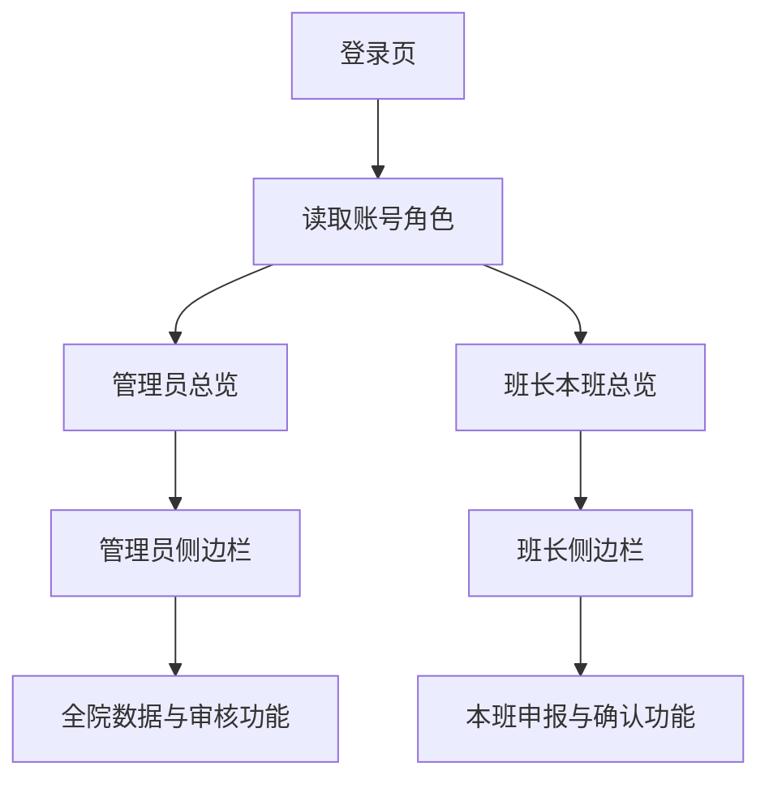
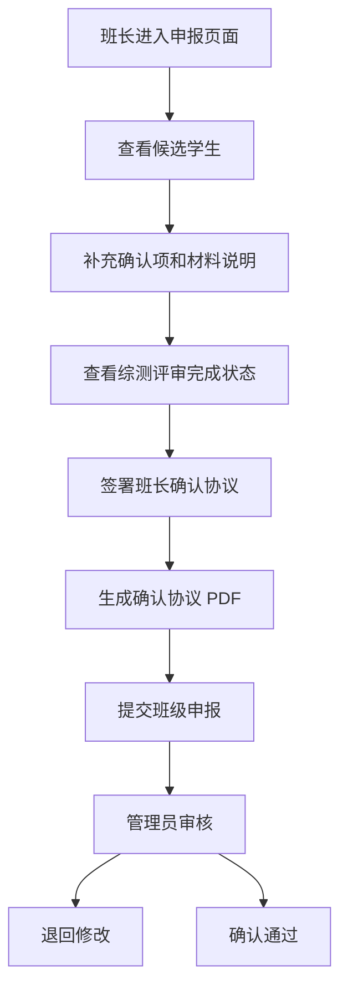
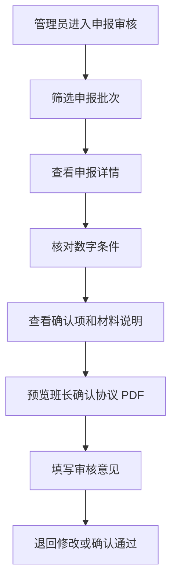

# 奖学金与荣誉称号申报系统前端设计书

## 一、文档范围

本文档用于指导奖学金与荣誉称号申报系统的前端页面设计和后续源码实现。设计范围包括登录页、双系统入口、管理员页面、班长页面、综测评审页面、奖学金申报页面、荣誉称号申报页面、申报审核页面、账号邮件页面、操作日志页面和系统设置页面。

本文档与以下材料保持一致：

| 材料 | 位置 | 关系 |
|---|---|---|
| 待办清单 | `todolist.md` | 记录业务规则、任务拆分、文件关系和验收标准。 |
| 前端视觉稿 | `output/frontend-mockups/` | 保存 Claude 简约风格页面图片、HTML 预览和图片提示词。 |
| 当前前端源码 | `packages/frontend/src/` | 后续实现需要遵循现有 React、Vite、Tailwind 结构。 |
| 后端接口封装 | `packages/frontend/src/lib/api.ts` | 后续新增接口统一通过 `api` 客户端调用。 |
| 身份信息 | `packages/frontend/src/lib/auth.ts` | 管理员和班长通过 `role` 区分页面权限。 |

当前阶段只形成前端设计书和视觉稿说明，暂缓修改真实前端源码。

## 二、设计原则

### 2.1 视觉风格

整体采用 Claude 式简约后台风格。页面以暖米色背景、低饱和陶土色强调、细边框卡片、清晰表格和克制按钮为主。视觉重心放在数据、状态和审核动作上，减少装饰性图形。

| 项目 | 设计要求 |
|---|---|
| 色彩 | 主背景使用暖米色，内容面板使用近白色，强调色使用陶土色，成功、警告、错误、信息状态使用低饱和色。 |
| 字体 | 中文界面使用清晰的无衬线字体，字号层级控制在 12、13、14、16、20、30 像素附近。 |
| 卡片 | 卡片圆角不超过 8 像素，边框优先于大阴影，避免多层嵌套卡片。 |
| 表格 | 数据密集页面优先使用表格，表头轻底色，数字列使用等宽数字样式。 |
| 按钮 | 每个页面只保留一个主按钮，次要动作使用浅色按钮或文本按钮。 |
| 图标 | 后续实现建议引入 `lucide-react`，用于导航、导入、下载、审核、设置、邮件、日志、签名等按钮。 |
| 装饰 | 避免渐变大背景、营销式首屏、装饰图形和无业务含义的动画。 |

### 2.2 角色分离

管理员账号和班长账号进入系统后看到的页面不同。前端需要在路由、侧边栏、页面数据、按钮权限和接口调用上同时做角色限制。

| 角色 | 页面范围 | 数据范围 | 主要操作 |
|---|---|---|---|
| 管理员 | 总览、数据导入、申报审核、奖学金管理、荣誉称号、账号邮件、操作日志、系统设置 | 全院数据 | 导入数据、配置规则、审核申报、退回修改、确认通过、导出材料、发送邮件、查看日志。 |
| 班长 | 本班总览、本班综测、奖学金申报、荣誉称号、提交记录、账号设置 | 本班数据 | 查看候选人、勾选确认项、补充材料说明、签署班长确认协议、提交申报、查看退回意见。 |
| 综测审核小组 | 综测评审页面中的签名区域 | 本班综测评审数据 | 核对综测分数并签名生成综测评审确认书。 |

综测审核小组只属于综测评审。奖学金申报页面和荣誉称号申报页面没有综测审核小组签名入口，只显示综测评审是否完成，并使用已经确认的综测分数作为候选筛选依据。

### 2.3 业务边界

国家奖学金和国家励志奖学金只由管理员导入名单，系统保存名单、标签和互斥依据，前端不提供系统内评选页面。

奖学金和荣誉称号均采用班级申报形式。系统只自动判断明确数字条件，例如德育分、体测成绩、社区表现分、学习排名、综测排名、名额和金额限制。违法违规违纪、学术不端、课程是否不及格、学生本人意愿、干部任职和活动证明等内容由班长勾选或填写材料说明，管理员在审核页查看。

港澳台侨、留学生、境外学生统一按计算机类班级学生处理。前端页面使用班级类别标签展示，不在申报页面增加单独学生类别判断入口。

## 三、视觉稿对应关系

| 图片 | 页面 | 角色 | 设计重点 |
|---|---|---|---|
| `01-login.png` | 登录页 | 管理员、班长 | 单登录面板、系统名称、简洁背景、账号密码输入。 |
| `02-system-entry.png` | 双系统入口 | 管理员、班长 | 综测系统和奖学金荣誉称号申报系统分开进入。 |
| `03-admin-dashboard.png` | 管理员总览 | 管理员 | 申报批次、导入状态、审核提醒、数据指标。 |
| `03b-monitor-dashboard.png` | 班长本班总览 | 班长 | 本班待办、确认项、协议签署、综测评审状态。 |
| `04-import-center.png` | 数据导入中心 | 管理员 | 综测、体测、社区表现、外部名单、名额、邮箱导入。 |
| `05-score-review.png` | 本班综测评审 | 班长、综测审核小组 | 综测表格、审核小组签名、确认书 PDF 状态。 |
| `06-scholarship-declaration.png` | 奖学金申报 | 班长 | 候选表、名额金额、确认项、班长协议签名、申报 PDF。 |
| `07-honor-declaration.png` | 荣誉称号申报 | 班长 | 称号候选、个人意愿、干部材料、班长协议签名、申报 PDF。 |
| `08-admin-review.png` | 管理员申报审核 | 管理员 | 申报列表、详情面板、协议 PDF、材料审核、退回和通过。 |
| `09-award-allocation.png` | 院奖分配 | 管理员、班长 | 名额、金额、等级人数结构和候选排序。 |
| `10-accounts-mail.png` | 账号邮件 | 管理员 | 班长账号、网易邮箱 SMTP、邮件模板、发送记录。 |
| `11-audit-logs.png` | 操作日志 | 管理员 | 模块筛选、操作记录、详情抽屉。 |
| `12-settings.png` | 系统设置 | 管理员 | 学年、开放状态、协议模板、PDF 坐标、邮箱配置入口。 |

## 四、信息架构

### 4.1 登录后分流

登录成功后，前端读取 `user.role`。管理员进入管理员总览，班长进入本班总览。根页面提供双系统入口，角色权限决定入口卡片的可点击状态。



### 4.2 管理员侧边栏

| 导航项 | 路由地址 | 说明 |
|---|---|---|
| 总览 | `/dashboard` | 展示全院申报进度、待审核数量、导入状态和提醒。 |
| 数据导入 | `/import` | 导入学生基础数据、综测数据、外部奖项名单、名额金额、班长邮箱。 |
| 申报审核 | `/declaration-reviews` | 查看奖学金和荣誉称号班级申报，执行退回或通过。 |
| 奖学金管理 | `/awards` | 查看奖学金候选、互斥标签、院奖分配方案。 |
| 荣誉称号 | `/honors` | 查看荣誉称号候选和材料状态。 |
| 账号邮件 | `/accounts-mail` | 管理班长账号、网易邮箱 SMTP、邮件模板和发送记录。 |
| 操作日志 | `/audit-logs` | 查询关键操作记录。 |
| 系统设置 | `/settings` | 管理学年、开放状态、协议模板、PDF 模板坐标和邮箱配置入口。 |

### 4.3 班长侧边栏

| 导航项 | 路由地址 | 说明 |
|---|---|---|
| 本班总览 | `/monitor/dashboard` | 展示本班待办、申报进度、退回意见和材料状态。 |
| 本班综测 | `/monitor/scores` | 查看本班综测分数，完成综测评审确认。 |
| 奖学金申报 | `/monitor/awards` | 查看奖学金候选，完成确认项、班长签名和申报提交。 |
| 荣誉称号 | `/monitor/honors` | 查看荣誉称号候选，补充材料说明并提交。 |
| 提交记录 | `/monitor/submissions` | 查看本班历史申报、审核状态、退回意见和 PDF 材料。 |
| 账号设置 | `/settings` | 修改密码和查看账号信息。 |

## 五、路由设计

当前项目在 `packages/frontend/src/App.tsx` 中使用简单路由表，路由状态由 `packages/frontend/src/lib/router.tsx` 管理。后续实现继续使用现有轻量路由系统，增加角色保护组件和路由配置。

| 路由地址 | 页面组件 | 允许角色 | 说明 |
|---|---|---|---|
| `/login` | `LoginRoute` | 未登录、已登录 | 登录页。已登录时根据角色跳转。 |
| `/` | `SystemEntryRoute` | 管理员、班长 | 双系统入口。 |
| `/dashboard` | `AdminDashboardRoute` | 管理员 | 管理员总览。 |
| `/monitor/dashboard` | `MonitorDashboardRoute` | 班长 | 班长本班总览。 |
| `/import` | `ImportRoute` | 管理员 | 数据导入中心。 |
| `/scores` | `ScoresRoute` | 管理员 | 全院或按班级查看综测数据。 |
| `/monitor/scores` | `MonitorScoresRoute` | 班长 | 本班综测评审和审核小组签名。 |
| `/awards` | `AwardsAdminRoute` | 管理员 | 奖学金候选和分配管理。 |
| `/monitor/awards` | `AwardsDeclarationRoute` | 班长 | 本班奖学金申报。 |
| `/honors` | `HonorsAdminRoute` | 管理员 | 荣誉称号候选和材料查看。 |
| `/monitor/honors` | `HonorsDeclarationRoute` | 班长 | 本班荣誉称号申报。 |
| `/declaration-reviews` | `DeclarationReviewsRoute` | 管理员 | 申报审核列表和详情。 |
| `/monitor/submissions` | `SubmissionsRoute` | 班长 | 本班提交记录。 |
| `/accounts-mail` | `AccountsMailRoute` | 管理员 | 班长账号和邮件管理。 |
| `/audit-logs` | `AuditLogsRoute` | 管理员 | 操作日志。 |
| `/settings` | `SettingsRoute` | 管理员、班长 | 管理员显示系统配置，班长显示账号设置。 |

角色保护规则放在 `RoleGuard` 中。无权限访问时显示无权限页面，并提供返回入口页按钮。

## 六、页面设计

### 6.1 登录页

登录页采用左右分栏。左侧展示系统名称、学院名称和少量指标，右侧为登录表单。表单包含账号、密码、登录按钮、错误提示和首次登录说明。

| 元素 | 交互 |
|---|---|
| 账号输入 | 输入后保留当前值，登录失败时不清空。 |
| 密码输入 | 支持显示和隐藏密码，回车触发登录。 |
| 登录按钮 | 请求期间显示加载状态并禁用重复点击。 |
| 错误提示 | 显示在表单顶部或相关字段下方，说明账号、密码或权限问题。 |

登录成功后，管理员进入 `/dashboard`，班长进入 `/monitor/dashboard`。

### 6.2 双系统入口页

入口页展示两个系统卡片：综合素质测评填写系统、奖学金与荣誉称号申报系统。卡片展示开放状态、当前学年、角色可进入范围。

| 状态 | 页面表现 |
|---|---|
| 系统开放 | 卡片主按钮可点击，状态标签为“开放中”。 |
| 系统关闭 | 卡片主按钮禁用，显示关闭原因和开放时间。 |
| 角色受限 | 卡片可查看但主按钮禁用，提示当前账号无访问权限。 |

### 6.3 管理员总览

管理员总览用于快速查看全院申报情况。页面上方展示关键指标，中央展示最新申报批次，右侧展示审核提醒。

| 区域 | 内容 |
|---|---|
| 指标区 | 待审核批次、材料待补、已通过批次、邮件发送失败数。 |
| 申报批次表 | 班级、申报类型、提交人、状态、提交时间。 |
| 审核提醒 | 国奖国励仅导入、院奖金额限制、确认协议缺失、材料待补等提醒。 |

### 6.4 班长本班总览

班长总览只展示本班数据。页面需要突出待办事项和阻止提交原因。

| 区域 | 内容 |
|---|---|
| 指标区 | 本班候选人数、确认项完成数、协议签署状态、综测评审状态。 |
| 本班待办 | 奖学金申报、荣誉称号申报、班长确认协议、综测评审完成状态。 |
| 本班提醒 | 权限范围、共同条件确认、签名要求、退回意见。 |

综测审核小组签名只在“本班综测”页面处理，总览中只显示进度和入口。

### 6.5 数据导入中心

数据导入中心只对管理员开放。页面按导入类型分组，提供模板下载、文件上传、导入校验、导入日志。

| 导入类型 | 主要字段 | 页面说明 |
|---|---|---|
| 学生基础名单 | 年级、班级、学号、姓名、班级类别 | 班级类别用于港澳台侨、留学生、境外学生统一处理。 |
| 综测数据 | 德育分、学业分、创新分、体测成绩、体育课成绩、社区表现分、综测总分 | 体测成绩和体育课成绩共同用于体育基础分计算。 |
| 国奖名单 | 学年、学号、姓名、奖项名称 | 只导入名单，不提供评选。 |
| 国励名单 | 学年、学号、姓名、奖项名称 | 只导入名单，不提供评选。 |
| 校奖名单 | 学年、学号、姓名、奖项等级 | 用于互斥和荣誉条件判断。 |
| 院奖名额金额表 | 学年、年级、班级、名额、可支配金额 | 用于院奖分配和超额校验。 |
| 先进班级和先进团支部名单 | 学年、班级、荣誉类型 | 用于优秀学生干部名额判断。 |
| 班长邮箱 | 年级、班级、班长姓名、邮箱 | 用于发送账号和通知。 |

文件上传后先显示校验结果。通过后允许确认导入。失败时显示行号、字段、原因和下载失败记录按钮。

### 6.6 本班综测评审页

本班综测评审页属于综测系统。该页面展示本班综测分数表，并提供综测审核小组签名区域。审核小组成员数量按班级配置，前端根据成员名单动态渲染签名项。

| 区域 | 内容 |
|---|---|
| 分数表 | 学号、姓名、德育分、学业分、创新分、体测成绩、体育课成绩、社区表现分、综测总分、排名。 |
| 计算说明 | 大一大二体育基础分为 `0.7 * 体测成绩 + 0.3 * 体育课成绩`，大三按体测成绩。 |
| 审核小组签名 | 每个成员一项，支持手写签名和上传电子签名图片。 |
| 确认书 PDF | 全部成员签名后生成班级综合素质测评审核小组确认书 PDF。 |

综测评审完成后，奖学金申报和荣誉称号申报页面只读取“综测评审已完成”状态。

### 6.7 奖学金申报页

奖学金申报页只对班长开放，页面只显示本班候选人和申报材料。国奖、国励不在该页面评选，只作为标签和互斥条件展示。

| 区域 | 内容 |
|---|---|
| 候选表 | 学生、综测总分、学业排名、德育分、体测成绩、社区表现分、建议奖项、互斥标签、状态。 |
| 院奖分配 | 名额、金额、一二三等奖人数结构、已选学生、总金额。 |
| 确认项 | 杂项共同条件逐项勾选，全部通过后继续。 |
| 综测评审状态 | 显示已完成或待完成；页面内无审核小组签名入口。 |
| 班长确认协议 | 班长手写签名或上传电子签名图片，生成确认协议 PDF。 |
| 提交按钮 | 数字条件、确认项、协议 PDF、名额金额均通过后启用。 |

提交前确认协议文案采用 `todolist.md` 中的班级奖学金与荣誉称号申报确认协议。协议弹窗展示完整文本、签名区域、PDF 预览状态和确认按钮。

### 6.8 荣誉称号申报页

荣誉称号申报页只对班长开放。页面按称号类型展示候选人，强调学生个人意愿和干部材料说明。

| 区域 | 内容 |
|---|---|
| 候选表 | 学生、申报称号、数字条件状态、个人意愿、材料状态。 |
| 材料说明 | 干部任职、任期、考核、活动组织、表彰情况、附件上传。 |
| 确认项 | 学生本人意愿、干部任职真实、活动证明真实、共同条件确认。 |
| 综测评审状态 | 显示已完成或待完成；页面内无审核小组签名入口。 |
| 班长确认协议 | 班长签名后生成荣誉称号确认协议 PDF。 |
| 提交按钮 | 候选人、确认项、材料说明和协议 PDF 完成后启用。 |

### 6.9 管理员申报审核页

管理员申报审核页展示所有班级提交的奖学金和荣誉称号申报。页面左侧为申报批次表，右侧为详情面板。

| 区域 | 内容 |
|---|---|
| 筛选区 | 学年、年级、班级、申报类型、审核状态、材料状态、标签。 |
| 申报表 | 班级、申报类型、人数、完整性、状态、提交时间。 |
| 详情面板 | 数字条件、确认项、班长确认协议 PDF、材料说明、退回记录。 |
| PDF 区 | 预览和下载班长确认协议、申报明细、证明材料汇总。 |
| 审核按钮 | 退回修改、确认通过、导出当前批次。 |

管理员审核奖学金和荣誉称号时，只检查综测评审完成状态。综测审核小组成员签名的具体采集在综测评审页面完成。

### 6.10 院奖分配页

院奖分配页展示院级奖学金名额、金额、候选排序和等级分配。管理员可查看全院或按班级筛选，班长只查看本班分配结果。

| 检查项 | 页面表现 |
|---|---|
| 名额 | 展示班级可推荐人数和已选人数。 |
| 金额 | 展示可支配金额、已使用金额、剩余额度。 |
| 人数结构 | 展示一二三等奖人数结构是否满足要求。 |
| 互斥 | 标出国奖、国励、校奖、教育部相关奖学金获得者。 |

### 6.11 账号邮件页

账号邮件页只对管理员开放。页面包含班长账号列表、班长邮箱导入、学术部网易邮箱 SMTP 配置、邮件模板编辑、测试发送、发送记录。

邮件发送方式如下：

| 项目 | 页面要求 |
|---|---|
| 首次准备 | 管理员在网易邮箱网页版开启 SMTP 服务并获取授权码。 |
| 系统配置 | 页面填写 SMTP 主机、端口、账号、授权码、发件人显示名、启用状态。 |
| 授权码展示 | 授权码保存后只显示掩码，不展示明文。 |
| 模板编辑 | 管理员在系统内编辑邮件标题和正文，支持变量预览。 |
| 测试发送 | 配置保存后可发送测试邮件。 |
| 发送记录 | 展示收件人、模板类型、发送状态、失败原因和重发按钮。 |

邮件模板至少包含班长账号通知、密码重置通知、申报开放通知、审核退回通知。

### 6.12 操作日志页

操作日志页只对管理员开放，用于查询关键操作记录。

| 筛选项 | 内容 |
|---|---|
| 系统 | 综测系统、奖学金荣誉称号申报系统。 |
| 模块 | 学生、分数、导入、导出、账号、申报、审核、邮件、设置。 |
| 操作人 | 管理员或班长账号。 |
| 时间 | 开始时间、结束时间。 |
| 操作对象 | 班级、学生、申报批次、文件或模板。 |

日志详情通过右侧抽屉展示，包含修改前值、修改后值、操作时间、操作人和关联业务记录。

### 6.13 系统设置页

管理员视图展示系统配置，班长视图展示账号设置。

| 管理员配置 | 页面要求 |
|---|---|
| 学年管理 | 创建学年、启用当前学年、查看状态。 |
| 系统开放状态 | 分别控制综测系统和申报系统开放状态。 |
| 确认协议模板 | 编辑班长确认协议文本，保存版本。 |
| PDF 模板坐标 | 配置班长确认协议签名坐标和综测评审确认书签名坐标。 |
| 邮件配置入口 | 跳转到账号邮件页。 |

## 七、关键交互

### 7.1 表格交互

表格支持筛选、排序、分页、批量选择和状态标签。超过 50 行的数据表后续实现虚拟列表或分页加载。移动端保留横向滚动，表头固定在表格容器顶部。

### 7.2 确认项交互

确认项采用复选框列表。每个确认项包含名称、适用范围、说明和状态。存在未勾选项时，提交按钮禁用，并在按钮附近显示原因。

### 7.3 签名交互

签名组件支持两种方式：

| 方式 | 交互 |
|---|---|
| 页面手写签字 | 打开签名弹窗，使用画布签名，支持清除、重签、确认、预览。 |
| 上传电子签名图片 | 支持 PNG、JPG 上传，显示预览，允许裁剪和确认。 |

签名确认后生成签名记录，记录签名人、签名方式、签名用途、确认时间和业务记录。签名用途区分班长确认协议、综测评审确认书。

### 7.4 PDF 生成交互

PDF 生成包含四个状态：未生成、生成中、已生成、生成失败。生成中显示进度状态，已生成后显示预览和下载按钮，失败时显示失败原因和重新生成按钮。

班长确认协议 PDF 与奖学金、荣誉称号申报批次关联。综测评审确认书 PDF 与综测评审记录关联。

### 7.5 申报提交流程



### 7.6 管理员审核流程



## 八、动效设计

动效只用于状态变化、层级展开和反馈确认。所有动画时长控制在 150 到 240 毫秒之间，复杂抽屉展开不超过 300 毫秒。

| 场景 | 动效要求 |
|---|---|
| 页面切换 | 内容区淡入，位移不超过 8 像素。 |
| 表格行悬停 | 背景色轻微变化，边框位置保持不变。 |
| 按钮点击 | 80 到 120 毫秒内给出按压反馈，请求中显示加载状态。 |
| 弹窗打开 | 轻微缩放和透明度变化，背景遮罩淡入。 |
| 抽屉打开 | 从右侧进入，保留页面上下文。 |
| 上传文件 | 显示进度条和状态标签。 |
| 签名确认 | 成功后在签名卡片内显示已确认状态。 |
| PDF 生成 | 生成中使用进度状态，完成后切换为预览卡片。 |

系统需要支持 `prefers-reduced-motion`。使用者系统设置减少动态效果时，页面只保留必要的透明度变化。

## 九、组件设计

| 组件 | 位置建议 | 职责 |
|---|---|---|
| `AppShell` | `components/layout/AppShell.tsx` | 提供页面框架、顶栏、侧边栏和内容区域。 |
| `Sidebar` | `components/layout/Sidebar.tsx` | 根据角色展示不同导航项。 |
| `RoleGuard` | `components/auth/RoleGuard.tsx` | 限制路由访问，处理无权限页面。 |
| `DataTable` | `components/common/DataTable.tsx` | 表格、排序、分页、空状态和加载状态。 |
| `StatusChip` | `components/common/StatusChip.tsx` | 统一状态标签样式。 |
| `MetricCard` | `components/common/MetricCard.tsx` | 总览页指标卡片。 |
| `Checklist` | `components/declarations/Checklist.tsx` | 申报确认项勾选。 |
| `DeclarationForm` | `components/declarations/DeclarationForm.tsx` | 班级申报表单主体。 |
| `ReviewDetailPanel` | `components/declarations/ReviewDetailPanel.tsx` | 管理员审核详情面板。 |
| `SignaturePad` | `components/signature/SignaturePad.tsx` | 手写签名画布。 |
| `SignatureUpload` | `components/signature/SignatureUpload.tsx` | 电子签名图片上传和预览。 |
| `PdfMaterialCard` | `components/pdf/PdfMaterialCard.tsx` | PDF 状态、预览、下载和重新生成。 |
| `MailTemplateEditor` | `components/mail/MailTemplateEditor.tsx` | 邮件模板编辑和变量预览。 |
| `SmtpConfigForm` | `components/mail/SmtpConfigForm.tsx` | 网易邮箱 SMTP 配置和测试发送。 |
| `AuditLogDrawer` | `components/audit/AuditLogDrawer.tsx` | 操作日志详情抽屉。 |

## 十、前端架构

当前前端使用 React 19、Vite、Tailwind 4。后续实现建议保持现有结构，在 `routes`、`components`、`hooks`、`lib` 下扩展。

```text
packages/frontend/src
  App.tsx
  routes
    SystemEntryRoute.tsx
    AdminDashboardRoute.tsx
    MonitorDashboardRoute.tsx
    AwardsAdminRoute.tsx
    AwardsDeclarationRoute.tsx
    HonorsAdminRoute.tsx
    HonorsDeclarationRoute.tsx
    DeclarationReviewsRoute.tsx
    AccountsMailRoute.tsx
    AuditLogsRoute.tsx
    MonitorScoresRoute.tsx
    SubmissionsRoute.tsx
  components
    awards
    honors
    declarations
    mail
    signature
    pdf
    audit
    common
  hooks
    useAwards.ts
    useHonors.ts
    useDeclarations.ts
    useMailSettings.ts
    useSignature.ts
    usePdfMaterials.ts
    useAuditLogs.ts
  lib
    api.ts
    auth.ts
    router.tsx
    permissions.ts
  types
    awards.ts
    honors.ts
    declarations.ts
    mail.ts
    files.ts
```

### 10.1 状态管理

项目当前未引入全局状态库。后续实现使用 React hooks 和局部状态即可满足需求。跨页面共享的数据放入 `api` 缓存或通过重新请求获取。

| 数据 | 状态策略 |
|---|---|
| 当前账号 | 继续使用 `localStorage` 中的 `token` 和 `user`。 |
| 学年、年级、班级 | 使用 `api` 客户端缓存短时间数据。 |
| 申报表单草稿 | 使用页面状态和本地临时保存，避免误关闭丢失。 |
| 上传文件 | 使用组件局部状态，记录上传进度和结果。 |
| 审核详情 | 切换申报批次时重新请求详情。 |

### 10.2 权限控制

前端权限控制分三层：

| 层级 | 要求 |
|---|---|
| 路由层 | `RoleGuard` 限制管理员和班长路由。 |
| 导航层 | 侧边栏根据角色展示不同导航项。 |
| 操作层 | 按钮根据角色、状态和数据范围决定启用状态。 |

后端仍需承担最终权限校验。前端权限控制用于减少误操作和提升页面清晰度。

### 10.3 API 封装

新增接口继续通过 `packages/frontend/src/lib/api.ts` 的 `api.get`、`api.post`、`api.put`、`api.delete`、`api.upload`、`api.download` 调用。非 GET 请求成功后清理缓存。文件下载使用 `api.download`。

## 十一、后端接口

以下接口为前端设计所需接口，实际实现时可根据后端路由命名统一调整。

### 11.1 系统与权限

| 方法 | 地址 | 用途 | 页面 |
|---|---|---|---|
| `GET` | `/system/entry-status` | 获取两个系统开放状态、当前学年和角色可访问范围。 | 双系统入口 |
| `GET` | `/system/settings` | 获取学年、开放状态、协议模板和 PDF 模板配置。 | 系统设置 |
| `PUT` | `/system/settings` | 保存系统开放状态和基础配置。 | 系统设置 |
| `GET` | `/auth/me` | 获取当前账号信息。 | 全部页面 |

### 11.2 数据导入

| 方法 | 地址 | 用途 | 页面 |
|---|---|---|---|
| `GET` | `/templates` | 获取可下载模板列表。 | 数据导入 |
| `GET` | `/templates/:type/download` | 下载指定导入模板。 | 数据导入 |
| `POST` | `/import/comprehensive-scores` | 导入综测数据、体测成绩、体育课成绩、社区表现分。 | 数据导入 |
| `POST` | `/external-awards/import` | 导入国奖、国励、校奖、教育部相关奖学金名单。 | 数据导入 |
| `POST` | `/award-quotas/import` | 导入院奖名额金额表。 | 数据导入 |
| `POST` | `/class-honors/import` | 导入先进班级和先进团支部名单。 | 数据导入 |
| `POST` | `/users/monitor-emails/import` | 导入班长邮箱。 | 数据导入、账号邮件 |
| `GET` | `/import/logs` | 获取导入日志。 | 数据导入 |

### 11.3 综测评审

| 方法 | 地址 | 用途 | 页面 |
|---|---|---|---|
| `GET` | `/scores/class/:classId` | 获取班级综测分数。 | 本班综测、管理员分数页 |
| `GET` | `/score-review-groups/:classId` | 获取班级综测审核小组成员和签名状态。 | 本班综测 |
| `PUT` | `/score-review-groups/:classId/members` | 配置班级综测审核小组成员。 | 系统设置或综测管理 |
| `POST` | `/score-review-groups/:classId/signatures` | 保存审核小组成员签名。 | 本班综测 |
| `POST` | `/score-review-groups/:classId/pdf` | 生成综测评审确认书 PDF。 | 本班综测 |
| `GET` | `/score-review-groups/:classId/status` | 获取综测评审完成状态。 | 奖学金申报、荣誉称号申报 |

### 11.4 奖学金

| 方法 | 地址 | 用途 | 页面 |
|---|---|---|---|
| `GET` | `/awards/candidates` | 获取奖学金候选人和数字条件状态。 | 奖学金管理、奖学金申报 |
| `GET` | `/awards/allocation` | 获取院奖分配方案。 | 院奖分配、奖学金申报 |
| `POST` | `/awards/allocation/preview` | 根据选择结果预览名额、金额、人数结构。 | 奖学金申报 |
| `GET` | `/award-declarations/class/:classId` | 获取本班奖学金申报草稿或提交记录。 | 奖学金申报 |
| `POST` | `/award-declarations` | 提交班级奖学金申报。 | 奖学金申报 |
| `PUT` | `/award-declarations/:id` | 修改退回后的奖学金申报。 | 奖学金申报 |

### 11.5 荣誉称号

| 方法 | 地址 | 用途 | 页面 |
|---|---|---|---|
| `GET` | `/honors/candidates` | 获取荣誉称号候选人和数字条件状态。 | 荣誉称号管理、荣誉称号申报 |
| `GET` | `/honor-declarations/class/:classId` | 获取本班荣誉称号申报草稿或提交记录。 | 荣誉称号申报 |
| `POST` | `/honor-declarations` | 提交班级荣誉称号申报。 | 荣誉称号申报 |
| `PUT` | `/honor-declarations/:id` | 修改退回后的荣誉称号申报。 | 荣誉称号申报 |
| `POST` | `/honor-declarations/:id/materials` | 上传或修改干部任职、活动证明等材料。 | 荣誉称号申报 |

### 11.6 申报审核

| 方法 | 地址 | 用途 | 页面 |
|---|---|---|---|
| `GET` | `/declaration-reviews` | 获取申报审核列表。 | 管理员申报审核 |
| `GET` | `/declaration-reviews/:id` | 获取申报详情。 | 管理员申报审核 |
| `POST` | `/declaration-reviews/:id/return` | 退回修改并填写意见。 | 管理员申报审核 |
| `POST` | `/declaration-reviews/:id/approve` | 确认通过。 | 管理员申报审核 |
| `GET` | `/monitor/submissions` | 获取本班提交记录。 | 班长提交记录 |

### 11.7 签名与 PDF

| 方法 | 地址 | 用途 | 页面 |
|---|---|---|---|
| `POST` | `/signatures` | 保存手写签名或电子签名图片。 | 签名弹窗 |
| `GET` | `/signatures/:id` | 获取签名预览。 | 签名弹窗、审核详情 |
| `POST` | `/agreements/:declarationId/sign` | 保存班长确认协议签署记录。 | 奖学金申报、荣誉称号申报 |
| `POST` | `/pdf-materials/generate` | 生成班长确认协议、申报明细或综测评审确认书 PDF。 | 申报页面、综测评审页 |
| `GET` | `/pdf-materials/:id` | 获取 PDF 预览。 | 申报页面、审核页面 |
| `GET` | `/pdf-materials/:id/download` | 下载 PDF。 | 申报页面、审核页面 |

### 11.8 账号与邮件

| 方法 | 地址 | 用途 | 页面 |
|---|---|---|---|
| `GET` | `/users` | 获取账号列表。 | 账号邮件 |
| `POST` | `/users/monitors/generate` | 批量生成班长账号。 | 账号邮件 |
| `POST` | `/users/:id/reset-password` | 重置密码。 | 账号邮件 |
| `GET` | `/mail/settings` | 获取网易邮箱 SMTP 配置状态。 | 账号邮件、系统设置 |
| `PUT` | `/mail/settings` | 保存网易邮箱 SMTP 配置。 | 账号邮件 |
| `POST` | `/mail/settings/test` | 发送测试邮件。 | 账号邮件 |
| `GET` | `/mail/templates` | 获取邮件模板。 | 账号邮件 |
| `PUT` | `/mail/templates/:id` | 保存邮件模板。 | 账号邮件 |
| `POST` | `/mail/send-monitor-accounts` | 发送班长账号邮件。 | 账号邮件 |
| `GET` | `/mail/logs` | 获取邮件发送记录。 | 账号邮件 |
| `POST` | `/mail/logs/:id/retry` | 重发失败邮件。 | 账号邮件 |

### 11.9 日志与导出

| 方法 | 地址 | 用途 | 页面 |
|---|---|---|---|
| `GET` | `/audit-logs` | 查询操作日志。 | 操作日志 |
| `GET` | `/audit-logs/:id` | 获取日志详情。 | 操作日志 |
| `GET` | `/export/declarations` | 导出申报汇总。 | 申报审核 |
| `GET` | `/export/award-allocation` | 导出院奖分配名单。 | 院奖分配 |
| `GET` | `/export/honor-declarations` | 导出荣誉称号申报表。 | 申报审核 |
| `GET` | `/export/mail-logs` | 导出邮件发送记录。 | 账号邮件 |

## 十二、状态与错误处理

| 状态 | 页面表现 |
|---|---|
| 加载中 | 表格使用骨架屏，按钮显示加载状态。 |
| 空数据 | 显示空状态说明和相关操作入口，例如下载模板或返回导入页。 |
| 加载失败 | 显示错误说明和重试按钮。 |
| 无权限 | 显示无权限页面，提供返回入口页按钮。 |
| 系统关闭 | 显示关闭原因、开放时间和管理员说明。 |
| 提交被阻止 | 在提交按钮附近列出阻止原因。 |
| 上传失败 | 显示失败行号、字段和下载失败记录按钮。 |
| PDF 生成失败 | 显示失败原因和重新生成按钮。 |
| 邮件发送失败 | 显示收件人、失败原因和重发按钮。 |

所有错误信息需要靠近相关字段或操作按钮展示，避免只在页面顶部显示笼统提示。

## 十三、响应式设计

项目以桌面端后台使用为主，最低需要兼容 1366 像素宽桌面。移动端用于查看状态和轻量修改。

| 宽度 | 布局要求 |
|---|---|
| 1440 像素及以上 | 左侧固定侧边栏，主内容使用两栏或三栏布局。 |
| 1024 到 1439 像素 | 侧边栏保持可见，右侧详情面板可以收窄。 |
| 768 到 1023 像素 | 侧边栏折叠为顶部导航或抽屉，表格横向滚动。 |
| 375 到 767 像素 | 页面以单列为主，关键按钮固定在表单底部，表格使用横向滚动容器。 |

签名画布在移动端保持固定宽高比例，避免签名区域因屏幕变化出现坐标偏移。

## 十四、可访问性要求

| 项目 | 要求 |
|---|---|
| 颜色对比 | 正文和背景对比度不低于 4.5:1。 |
| 键盘操作 | 表单、按钮、弹窗、抽屉和表格操作支持键盘访问。 |
| 表单标签 | 所有输入框使用可见标签。 |
| 错误提示 | 错误信息靠近对应字段，并支持屏幕阅读器读取。 |
| 图标按钮 | 图标按钮需要 `aria-label`。 |
| 表格排序 | 排序列提供当前排序状态。 |
| 动效减少 | 支持系统减少动态效果设置。 |
| 文件上传 | 文件选择按钮、拖拽区域和上传进度都有文本说明。 |

## 十五、验收标准

| 检查项 | 标准 |
|---|---|
| 角色页面 | 管理员和班长进入系统后看到不同侧边栏、不同首页和不同操作按钮。 |
| 双系统入口 | 综测系统和奖学金荣誉称号申报系统入口清晰，并显示开放状态。 |
| 国奖国励 | 页面只提供名单导入和标签展示，无系统内评选页面。 |
| 计算机类班级 | 港澳台侨、留学生、境外学生统一按计算机类班级学生规则展示和筛选。 |
| 综测审核小组 | 只在综测评审页面出现签名入口；奖学金和荣誉称号申报页面无审核小组签名入口。 |
| 奖学金申报 | 候选人、互斥标签、名额金额、确认项、班长协议签名和 PDF 状态完整。 |
| 荣誉称号申报 | 候选人、个人意愿、干部材料、确认项、班长协议签名和 PDF 状态完整。 |
| 管理员审核 | 能查看申报详情、确认项、班长确认协议 PDF、材料说明，并能退回或通过。 |
| 邮件能力 | 管理员能配置学术部网易邮箱 SMTP、编辑模板、测试发送、查看发送记录。 |
| 签名能力 | 支持页面手写签字和上传电子签名图片，签名记录有签名人、用途和时间。 |
| PDF 能力 | 班长确认协议和综测评审确认书能按模板生成、预览、下载和归档。 |
| 动效 | 页面动效克制，状态变化清晰，支持减少动态效果。 |
| 响应式 | 桌面端信息密度合理，移动端无文字重叠和按钮溢出。 |
| 文档一致性 | `前端设计书.md`、`todolist.md` 和 `output/frontend-mockups/` 中的页面关系一致。 |
