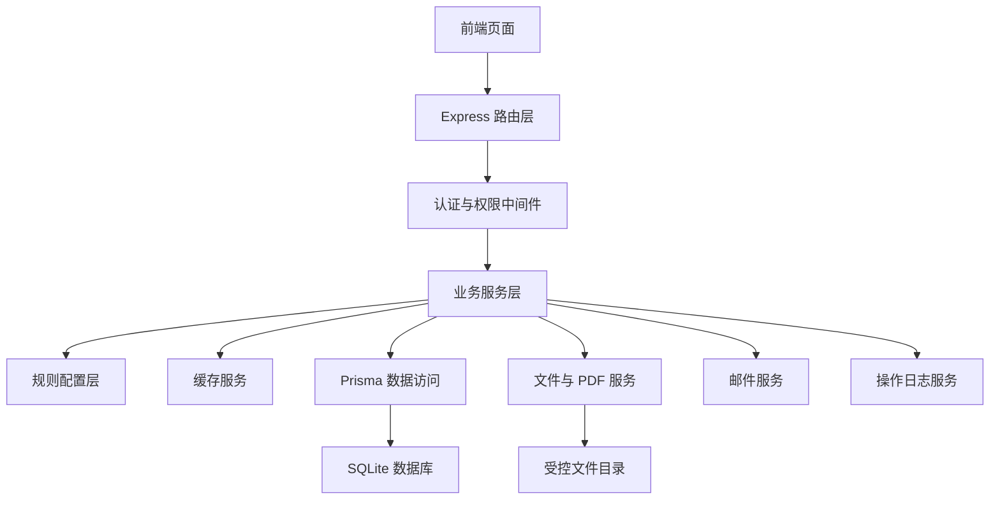

# 奖学金与荣誉称号申报系统后端设计书

## 一、文档范围

本文档用于指导奖学金与荣誉称号申报系统的后端架构设计和后续源码实现。设计范围包括数据库模型、后端模块、业务规则服务、接口、缓存、权限、事务、文件存储、签名、PDF、邮件、日志、导入导出和测试。

本文档与以下材料保持一致：

| 材料 | 位置 | 关系 |
|---|---|---|
| 待办清单 | `todolist.md` | 记录业务规则、任务拆分、文件关系和验收标准。 |
| 前端设计书 | `前端设计书.md` | 提供页面、路由、交互、接口和角色权限需求。 |
| 当前后端源码 | `packages/backend/src/` | 后续实现继续使用现有 Express、Prisma、SQLite、TypeScript 结构。 |
| 当前数据库模型 | `packages/backend/prisma/schema.prisma` | 后续扩展以现有用户、年级、班级、学生、学年、分数和导入日志模型为基础。 |

当前阶段形成后端设计书，后续实现时以本文档、`todolist.md` 和 `前端设计书.md` 共同作为依据。

## 二、设计原则

### 2.1 保持现有后端结构

当前后端已经形成清晰的 Express 分层结构：

| 层级 | 当前位置 | 后续处理 |
|---|---|---|
| 服务入口 | `packages/backend/src/index.ts` | 继续集中注册路由、中间件、错误处理和 WebSocket。 |
| 路由层 | `packages/backend/src/routes/` | 新增业务路由文件，保持每个业务域一个路由文件。 |
| 服务层 | `packages/backend/src/services/` | 新增业务服务文件，把筛选、申报、审核、邮件、PDF 等逻辑放在服务层。 |
| 配置层 | `packages/backend/src/config/` | 新增奖学金、荣誉称号、申报确认项、邮件和系统设置相关规则。 |
| 中间件 | `packages/backend/src/middleware/` | 扩展现有认证与权限判断，保留 `authMiddleware`、`adminOnly`、`monitorClassCheck` 的使用方式。 |
| 工具层 | `packages/backend/src/utils/` | 扩展体育基础分、排名、哈希、文件名、日期格式等工具函数。 |

新增能力采用“新增文件、少量接入”的方式接入现有后端。已有综测导入、分数计算、用户管理、导出接口保持当前职责，新增申报系统逻辑通过服务层组合已有能力。

### 2.2 业务规则边界

系统只自动处理明确数字条件和已导入名单条件。违法违规违纪、学术不端、课程通过情况、学生本人意愿、干部任职和活动证明等杂项条件由班长通过确认项或材料说明提交，管理员在审核页面查看。

国奖和国励只通过名单导入保存标签和约束依据，系统内无国奖和国励评选接口。奖学金和荣誉称号均采用班级统一申报形式。管理员接收申报、查看材料、退回修改或确认通过。

港澳台侨、留学生、境外学生统一按计算机类班级学生处理。后端以 `Class.studentGroupType = computer_category` 或 `Class.isComputerCategory = true` 作为判断依据。

综测审核小组只属于综测评审。奖学金和荣誉称号申报服务只读取综测评审完成状态和已确认的综测分数，申报模块内无综测审核小组签名逻辑。

### 2.3 页面流畅性目标

后端需要配合前端页面切换和数据密集页面加载。当前项目是单进程 Express 加 SQLite，初期采用进程内 TTL 缓存和 HTTP 条件缓存即可满足需求，暂缓引入 Redis。

缓存设计服务于以下页面：

| 页面 | 后端支持 |
|---|---|
| 双系统入口 | 缓存当前学年、开放状态、角色入口权限。 |
| 管理员总览 | 缓存申报批次统计、待审核数量、邮件失败数量、导入状态。 |
| 班长总览 | 缓存本班申报状态、综测评审状态、协议状态、退回提醒。 |
| 奖学金申报 | 缓存班级候选名单、院奖分配预览、互斥标签。 |
| 荣誉称号申报 | 缓存班级候选名单、材料状态、综测评审状态。 |
| 管理员审核 | 缓存审核列表，详情按需读取。 |
| 邮件模板 | 缓存模板内容和变量定义。 |

所有写入类操作成功后需要清理相关缓存，确保页面再次读取到最新数据。

## 三、当前后端现状

### 3.1 技术栈

| 项目 | 当前使用 |
|---|---|
| 运行框架 | Express 4 |
| 语言 | TypeScript |
| 数据库访问 | Prisma 6 |
| 数据库 | SQLite |
| Excel 处理 | ExcelJS |
| 上传处理 | multer |
| 认证 | jsonwebtoken |
| 实时能力 | ws |
| 压缩导出 | archiver |

后续需要新增的依赖建议如下：

| 依赖 | 用途 |
|---|---|
| `nodemailer` | 通过学术部网易邮箱 SMTP 发送邮件。 |
| `pdf-lib` | 在 PDF 模板中写入文本和签名图片，生成带签名 PDF。 |
| `sharp` | 裁剪或压缩上传的签名图片。该依赖可在实现签名图片裁剪时加入。 |
| `vitest` | 服务层和规则函数测试。 |
| `supertest` | Express 接口测试。 |

### 3.2 当前主要文件

| 文件 | 当前职责 |
|---|---|
| `packages/backend/src/index.ts` | 创建 Express 应用，注册现有路由和 WebSocket。 |
| `packages/backend/prisma/schema.prisma` | 定义用户、年级、班级、学生、学年、分数、导入日志模型。 |
| `packages/backend/src/routes/scores.ts` | 提供班级分数、学生分数、分数修改、计算和校验接口。 |
| `packages/backend/src/services/scoreService.ts` | 读取和更新分数，重新计算体育总分和综测总分。 |
| `packages/backend/src/services/importService.ts` | 导入学业成绩、体育基础分、个人综测表。 |
| `packages/backend/src/middleware/auth.ts` | 提供登录校验、管理员校验、本班权限校验。 |
| `packages/backend/src/config/scoreRules.ts` | 定义综测分数项、可编辑范围和计算规则。 |

现有分数服务可以继续作为奖学金与荣誉称号筛选的数据来源。后续只需要扩展体测成绩、体育课成绩、社区表现分、排名和班级类别相关字段与读取能力。

## 四、目标后端模块

### 4.1 总体组件关系



### 4.2 目录规划

```text
packages/backend/src
  config
    awardRules.ts
    honorRules.ts
    declarationRules.ts
    mailRules.ts
    pdfTemplates.ts
  middleware
    auth.ts
    cacheHeaders.ts
  routes
    systemSettings.ts
    templates.ts
    externalAwards.ts
    awardQuotas.ts
    classHonors.ts
    awards.ts
    awardDeclarations.ts
    honors.ts
    honorDeclarations.ts
    declarationReviews.ts
    agreements.ts
    signatures.ts
    pdfMaterials.ts
    scoreReviewGroups.ts
    tags.ts
    auditLogs.ts
    mailSettings.ts
    mailTemplates.ts
    mailLogs.ts
  services
    cacheService.ts
    systemSettingService.ts
    templateService.ts
    externalAwardImportService.ts
    awardQuotaService.ts
    classHonorImportService.ts
    awardService.ts
    awardAllocationService.ts
    awardDeclarationService.ts
    honorService.ts
    honorDeclarationService.ts
    declarationReviewService.ts
    agreementService.ts
    scoreReviewGroupService.ts
    signatureService.ts
    pdfService.ts
    fileStorageService.ts
    tagService.ts
    auditService.ts
    mailConfigService.ts
    mailTemplateService.ts
    mailService.ts
  types
    award.ts
    honor.ts
    declaration.ts
    file.ts
    mail.ts
    audit.ts
```

### 4.3 模块职责

| 模块 | 职责 |
|---|---|
| 规则配置 | 保存奖学金、荣誉称号、申报确认项、互斥关系、金额和人数结构规则。 |
| 候选筛选 | 根据综测分数、排名、班级类别、体测成绩、社区表现分和名单标签生成候选结果。 |
| 班级申报 | 保存班级申报批次、学生明细、确认项、材料说明、签名协议和状态。 |
| 管理员审核 | 提供审核列表、详情、退回、通过、审核意见和状态记录。 |
| 综测评审 | 保存综测审核小组成员、签名状态、确认书 PDF 和完成状态。 |
| 文件与 PDF | 保存签名图片、材料文件、PDF 文件元数据和受控访问。 |
| 邮件 | 保存网易邮箱 SMTP 配置、邮件模板、发送记录和重发记录。 |
| 日志 | 保存关键修改、导入、导出、申报、审核、邮件动作。 |
| 缓存 | 缓存读取频率高、计算成本较高、页面切换频繁的数据。 |

## 五、数据模型设计

### 5.1 现有模型扩展

| 模型 | 字段 | 类型 | 用途 |
|---|---|---|---|
| `User` | `email` | `String?` | 班长邮箱，用于账号通知和密码重置。 |
| `User` | `lastLoginAt` | `DateTime?` | 账号安全和使用状态展示。 |
| `Class` | `studentGroupType` | `String` | `regular`、`computer_category`。 |
| `Class` | `isComputerCategory` | `Boolean` | 查询和筛选时快速判断计算机类班级。 |
| `Score` | `category` 新增值 | `physical_test`、`pe_course`、`community` | 体测成绩、体育课成绩、社区表现分。 |
| `ImportLog` | `academicYearId` | `Int?` | 记录导入数据对应学年。 |
| `ImportLog` | `sourceType` | `String?` | 记录模板类型或外部名单类型。 |

`Score.category` 建议扩展为以下值：

| 分类 | 含义 | 用途 |
|---|---|---|
| `physical_test` | 大学生体质健康测试成绩 | 奖学金共同数字条件和体育基础分计算。 |
| `pe_course` | 体育课成绩 | 大一大二体育基础分计算。 |
| `community` | 社区表现分 | 奖学金共同数字条件。 |
| `sports_base` | 体育基础分 | 由体测和体育课成绩按年级计算。 |

体育基础分计算规则由 `calculateSportsBaseScore` 统一处理：

| 年级阶段 | 计算规则 |
|---|---|
| 大一 | `0.7 * physical_test + 0.3 * pe_course` |
| 大二 | `0.7 * physical_test + 0.3 * pe_course` |
| 大三 | `physical_test` |

### 5.2 新增核心模型

| 模型 | 主要字段 | 职责 |
|---|---|---|
| `ExternalAwardRecord` | `academicYearId`、`studentId`、`awardType`、`awardName`、`level`、`sourceImportLogId` | 保存国奖、国励、校奖、教育部相关奖学金名单。 |
| `AwardQuota` | `academicYearId`、`classId`、`quotaCount`、`availableAmount`、`remark` | 保存院奖班级名额和金额控制数据。 |
| `ClassHonorRecord` | `academicYearId`、`classId`、`honorType`、`sourceImportLogId` | 保存先进班级和先进团支部名单。 |
| `DeclarationBatch` | `academicYearId`、`classId`、`declarationType`、`status`、`submittedBy`、`submittedAt`、`reviewedBy`、`reviewedAt`、`reviewOpinion` | 保存班级统一申报批次。 |
| `DeclarationStudent` | `batchId`、`studentId`、`itemType`、`itemLevel`、`amount`、`conditionSnapshotJson`、`materialJson`、`status` | 保存每名学生的申报明细和条件快照。 |
| `DeclarationChecklistItem` | `batchId`、`code`、`label`、`checked`、`checkedBy`、`checkedAt` | 保存班长确认项。 |
| `AgreementSignature` | `batchId`、`agreementVersion`、`signatureFileId`、`pdfFileId`、`signedBy`、`signedAt` | 保存班长确认协议签署记录。 |
| `ScoreReviewRecord` | `academicYearId`、`classId`、`status`、`pdfFileId`、`completedAt` | 保存班级综测评审完成记录。 |
| `ScoreReviewGroupMember` | `recordId`、`name`、`roleName`、`sortOrder`、`signatureFileId`、`signedAt` | 保存综测审核小组成员和签名。 |
| `SignatureFile` | `signerName`、`method`、`purpose`、`originalFileId`、`croppedFileId`、`createdBy`、`createdAt` | 保存手写签名或电子签名图片记录。 |
| `StoredFile` | `fileName`、`fileType`、`mimeType`、`storageKey`、`sha256`、`size`、`createdBy`、`createdAt` | 保存文件元数据。 |
| `PdfFile` | `storedFileId`、`pdfType`、`templateVersion`、`businessType`、`businessId`、`generatedBy`、`generatedAt` | 保存 PDF 文件业务关系。 |
| `Tag` | `academicYearId`、`studentId`、`classId`、`tagType`、`tagName`、`sourceType`、`sourceId` | 保存奖项、候选、申报、审核状态标签。 |
| `AuditLog` | `module`、`action`、`actorId`、`targetType`、`targetId`、`beforeJson`、`afterJson`、`createdAt` | 保存关键操作记录。 |
| `MailConfig` | `smtpHost`、`smtpPort`、`username`、`passwordEncrypted`、`senderName`、`enabled` | 保存学术部网易邮箱 SMTP 配置。 |
| `MailTemplate` | `templateType`、`subject`、`body`、`variablesJson`、`version`、`enabled` | 保存管理员维护的邮件模板。 |
| `MailLog` | `templateType`、`recipientEmail`、`subject`、`contentDigest`、`status`、`failureReason`、`sentBy`、`sentAt` | 保存邮件发送记录。 |
| `SystemSetting` | `key`、`valueJson`、`updatedBy`、`updatedAt` | 保存开放状态、协议模板、PDF 坐标等设置。 |

### 5.3 申报状态

| 状态 | 含义 | 可执行操作 |
|---|---|---|
| `draft` | 班长暂存或已创建草稿 | 班长可修改。 |
| `submitted` | 班长已提交 | 管理员可审核，班长只可查看。 |
| `returned` | 管理员退回修改 | 班长可修改后重新提交。 |
| `approved` | 管理员确认通过 | 班长和管理员可查看，管理员可导出。 |

申报提交时需要保存候选人的条件快照。后续分数或名单重新导入时，已提交申报仍能展示当时提交依据；管理员审核时同时展示当前数据状态提醒。

## 六、缓存设计

### 6.1 缓存组件

新增 `packages/backend/src/services/cacheService.ts`，采用进程内 TTL 缓存。缓存键由命名空间、学年、班级、角色、筛选条件组成。

建议能力如下：

| 方法 | 用途 |
|---|---|
| `get(namespace, key)` | 获取缓存值。 |
| `set(namespace, key, value, ttlMs)` | 写入缓存值。 |
| `memo(namespace, key, ttlMs, loader)` | 有缓存时返回缓存，过期时执行读取函数。 |
| `invalidate(namespace, key)` | 删除单个缓存。 |
| `invalidatePrefix(namespace, prefix)` | 按前缀删除缓存。 |
| `clear(namespace)` | 清空指定命名空间。 |

缓存服务只缓存读取结果，数据库仍是唯一事实来源。上传文件、发送邮件、审核状态、PDF 生成等写入动作完成后清理相关缓存。

### 6.2 缓存范围和时间

| 命名空间 | 数据 | 建议时间 |
|---|---|---:|
| `academicYear` | 当前学年 | 5 分钟 |
| `classTree` | 年级班级树 | 5 分钟 |
| `systemStatus` | 系统开放状态和入口状态 | 30 秒 |
| `scoreClass` | 班级综测分数和排名 | 30 秒 |
| `scoreReviewStatus` | 班级综测评审完成状态 | 30 秒 |
| `awardCandidates` | 奖学金候选名单 | 30 秒 |
| `awardAllocation` | 院奖分配预览 | 30 秒 |
| `honorCandidates` | 荣誉称号候选名单 | 30 秒 |
| `declarationList` | 管理员审核列表和班长提交记录 | 15 秒 |
| `dashboard` | 管理员总览和班长总览 | 15 秒 |
| `mailTemplate` | 邮件模板 | 5 分钟 |
| `tagSummary` | 标签统计 | 30 秒 |

### 6.3 缓存清理规则

| 写入动作 | 清理范围 |
|---|---|
| 导入学生、班级数据 | `classTree`、`dashboard`、`awardCandidates`、`honorCandidates` |
| 导入综测数据 | `scoreClass`、`scoreReviewStatus`、`awardCandidates`、`honorCandidates`、`dashboard` |
| 修改单个分数 | 该学生所在班级的 `scoreClass`、候选名单、总览缓存 |
| 导入国奖、国励、校奖名单 | `awardCandidates`、`honorCandidates`、`tagSummary`、`dashboard` |
| 导入院奖名额金额 | `awardAllocation`、`awardCandidates`、`dashboard` |
| 配置综测审核小组成员 | `scoreReviewStatus`、`dashboard` |
| 保存综测审核小组签名 | `scoreReviewStatus`、`dashboard` |
| 提交奖学金或荣誉称号申报 | `declarationList`、`dashboard`、`tagSummary` |
| 审核退回或通过 | `declarationList`、`dashboard`、`tagSummary` |
| 修改系统开放状态 | `systemStatus`、`dashboard` |
| 修改邮件模板 | `mailTemplate` |
| 发送邮件或重发邮件 | `dashboard`、邮件日志列表缓存 |

### 6.4 HTTP 缓存

新增 `packages/backend/src/middleware/cacheHeaders.ts`，用于 GET 接口返回 `ETag` 或 `Last-Modified`。适用接口包括：

| 接口 | 建议 |
|---|---|
| `/api/templates` | 模板列表变化较少，可返回 `ETag`。 |
| `/api/system/entry-status` | 返回短时间 `Cache-Control: private, max-age=15`。 |
| `/api/mail/templates` | 返回 `ETag`，模板修改后变化。 |
| `/api/pdf-materials/:id` | 文件生成后内容固定，可返回 `ETag`。 |

用户身份相关数据使用 `private` 缓存指令，避免共享缓存保存个人数据。

## 七、业务规则服务设计

### 7.1 奖学金规则

新增 `packages/backend/src/config/awardRules.ts`，保存奖学金规则。

| 规则 | 后端处理 |
|---|---|
| 国奖 | 只导入名单，生成标签和互斥依据。 |
| 国励 | 只导入名单，生成标签和互斥依据。 |
| 校奖候选 | 根据学习排名、综测排名、班级类别和共同数字条件筛选。 |
| 院奖候选 | 根据学习排名、综测排名、班级类别、德育分、体测成绩、社区表现分筛选。 |
| 院奖金额 | 一等奖 1000 元、二等奖 800 元、三等奖 600 元。 |
| 院奖人数结构 | 一等奖人数小于等于二等奖人数，二等奖人数小于等于三等奖人数。 |
| 互斥 | 国奖、国励、校奖、教育部相关奖学金名单用于院奖排除。 |

`awardService.ts` 负责候选筛选，`awardAllocationService.ts` 负责院奖分配预览。候选接口返回每个学生的条件状态，便于前端展示阻止原因。

### 7.2 荣誉称号规则

新增 `packages/backend/src/config/honorRules.ts`，保存荣誉称号规则。

| 荣誉称号 | 后端数字判断 |
|---|---|
| 校级优秀学生 | 奖学金标签、综测排名、德育分、体测成绩。 |
| 院级优秀学生 | 院级一等奖学金及以上标签、校级优秀学生相关数字条件。 |
| 校级优秀学生干部 | 综测排名、学习排名、班级类别、德育分。 |
| 院级优秀学生干部 | 学习成绩条件、先进班级或先进团支部名单带来的上报名额。 |

个人意愿、干部任职、任期、考核、活动组织和表彰情况由 `DeclarationStudent.materialJson` 保存，管理员审核时查看。

### 7.3 申报确认规则

新增 `packages/backend/src/config/declarationRules.ts`，保存申报确认项和提交要求。

| 检查项 | 适用范围 | 后端处理 |
|---|---|---|
| 数字条件通过 | 奖学金、荣誉称号 | 服务层重新校验候选状态。 |
| 综测评审完成 | 奖学金、荣誉称号 | 读取 `ScoreReviewRecord.status = completed`。 |
| 确认项全部勾选 | 奖学金、荣誉称号 | 检查 `DeclarationChecklistItem.checked`。 |
| 班长确认协议 PDF | 奖学金、荣誉称号 | 检查 `AgreementSignature.pdfFileId`。 |
| 材料说明 | 荣誉称号、优秀学生干部 | 检查 `materialJson` 中所需字段。 |
| 院奖金额和人数结构 | 院级奖学金 | 检查分配结果。 |

提交接口需要在事务中重新执行关键校验，避免页面缓存过期导致提交错误。

## 八、接口设计

后端真实接口统一挂载在 `/api` 前缀下。前端设计书中的 `/awards/candidates` 对应后端 `/api/awards/candidates`。

### 8.1 响应格式

新增接口建议使用统一格式：

```json
{
  "data": {},
  "meta": {
    "requestId": "string",
    "cached": false
  }
}
```

分页列表使用：

```json
{
  "data": [],
  "pagination": {
    "page": 1,
    "pageSize": 20,
    "total": 100
  }
}
```

错误响应使用：

```json
{
  "error": "错误提示",
  "code": "DECLARATION_MISSING_AGREEMENT",
  "details": []
}
```

已有接口可以保持当前返回结构，新接口优先使用统一格式。

### 8.2 系统与权限接口

| 方法 | 后端地址 | 权限 | 服务 |
|---|---|---|---|
| `GET` | `/api/system/entry-status` | 登录用户 | `systemSettingService.getEntryStatus` |
| `GET` | `/api/system/settings` | 管理员 | `systemSettingService.getSettings` |
| `PUT` | `/api/system/settings` | 管理员 | `systemSettingService.updateSettings` |
| `GET` | `/api/auth/me` | 登录用户 | `authService.getCurrentUser` |

`entry-status` 返回两个系统开放状态、当前学年、角色可进入范围和关闭原因。

### 8.3 数据导入接口

| 方法 | 后端地址 | 权限 | 服务 |
|---|---|---|---|
| `GET` | `/api/templates` | 管理员 | `templateService.listTemplates` |
| `GET` | `/api/templates/:type/download` | 管理员 | `templateService.downloadTemplate` |
| `POST` | `/api/import/comprehensive-scores` | 管理员 | `importService.importComprehensiveScores` |
| `POST` | `/api/external-awards/import` | 管理员 | `externalAwardImportService.importRecords` |
| `POST` | `/api/award-quotas/import` | 管理员 | `awardQuotaService.importQuotas` |
| `POST` | `/api/class-honors/import` | 管理员 | `classHonorImportService.importRecords` |
| `POST` | `/api/users/monitor-emails/import` | 管理员 | `userService.importMonitorEmails` |
| `GET` | `/api/import/logs` | 管理员 | `importService.getImportLogs` |

所有导入接口需要返回成功数、失败数、失败明细和导入日志编号。

### 8.4 综测评审接口

| 方法 | 后端地址 | 权限 | 服务 |
|---|---|---|---|
| `GET` | `/api/scores/class/:classId` | 管理员或本班班长 | `scoreService.getScoresByClass` |
| `GET` | `/api/score-review-groups/:classId` | 管理员或本班班长 | `scoreReviewGroupService.getGroup` |
| `PUT` | `/api/score-review-groups/:classId/members` | 管理员 | `scoreReviewGroupService.setMembers` |
| `POST` | `/api/score-review-groups/:classId/signatures` | 管理员或本班班长 | `scoreReviewGroupService.saveSignature` |
| `POST` | `/api/score-review-groups/:classId/pdf` | 管理员或本班班长 | `scoreReviewGroupService.generatePdf` |
| `GET` | `/api/score-review-groups/:classId/status` | 管理员或本班班长 | `scoreReviewGroupService.getStatus` |

综测审核小组成员数量按班级配置生成。全部成员完成签名后，后端允许生成综测评审确认书 PDF。

### 8.5 奖学金接口

| 方法 | 后端地址 | 权限 | 服务 |
|---|---|---|---|
| `GET` | `/api/awards/candidates` | 管理员或本班班长 | `awardService.getCandidates` |
| `GET` | `/api/awards/allocation` | 管理员或本班班长 | `awardAllocationService.getAllocation` |
| `POST` | `/api/awards/allocation/preview` | 管理员或本班班长 | `awardAllocationService.preview` |
| `GET` | `/api/award-declarations/class/:classId` | 管理员或本班班长 | `awardDeclarationService.getClassDeclaration` |
| `POST` | `/api/award-declarations` | 本班班长 | `awardDeclarationService.submit` |
| `PUT` | `/api/award-declarations/:id` | 本班班长 | `awardDeclarationService.updateReturned` |

候选接口支持 `academicYearId`、`classId`、`awardType`、`status`、`tag` 查询参数。班长账号访问时，后端强制使用账号绑定班级。

### 8.6 荣誉称号接口

| 方法 | 后端地址 | 权限 | 服务 |
|---|---|---|---|
| `GET` | `/api/honors/candidates` | 管理员或本班班长 | `honorService.getCandidates` |
| `GET` | `/api/honor-declarations/class/:classId` | 管理员或本班班长 | `honorDeclarationService.getClassDeclaration` |
| `POST` | `/api/honor-declarations` | 本班班长 | `honorDeclarationService.submit` |
| `PUT` | `/api/honor-declarations/:id` | 本班班长 | `honorDeclarationService.updateReturned` |
| `POST` | `/api/honor-declarations/:id/materials` | 本班班长 | `honorDeclarationService.saveMaterials` |

材料接口支持文本说明和附件文件。文件权限由 `fileStorageService` 判断。

### 8.7 申报审核接口

| 方法 | 后端地址 | 权限 | 服务 |
|---|---|---|---|
| `GET` | `/api/declaration-reviews` | 管理员 | `declarationReviewService.list` |
| `GET` | `/api/declaration-reviews/:id` | 管理员 | `declarationReviewService.getDetail` |
| `POST` | `/api/declaration-reviews/:id/return` | 管理员 | `declarationReviewService.returnForRevision` |
| `POST` | `/api/declaration-reviews/:id/approve` | 管理员 | `declarationReviewService.approve` |
| `GET` | `/api/monitor/submissions` | 本班班长 | `declarationReviewService.listMonitorSubmissions` |

审核列表默认分页，支持学年、年级、班级、申报类型、审核状态、材料状态和标签筛选。

### 8.8 签名与 PDF 接口

| 方法 | 后端地址 | 权限 | 服务 |
|---|---|---|---|
| `POST` | `/api/signatures` | 登录用户 | `signatureService.create` |
| `GET` | `/api/signatures/:id` | 文件所属班级或管理员 | `signatureService.getPreview` |
| `POST` | `/api/agreements/:declarationId/sign` | 本班班长 | `agreementService.sign` |
| `POST` | `/api/pdf-materials/generate` | 登录用户 | `pdfService.generate` |
| `GET` | `/api/pdf-materials/:id` | 文件所属班级或管理员 | `pdfService.getPreview` |
| `GET` | `/api/pdf-materials/:id/download` | 文件所属班级或管理员 | `pdfService.download` |

签名接口支持两种输入：手写签名图片和上传电子签名图片。后端校验图片类型、大小、用途和业务记录归属。

### 8.9 账号与邮件接口

| 方法 | 后端地址 | 权限 | 服务 |
|---|---|---|---|
| `GET` | `/api/users` | 管理员 | `userService.listUsers` |
| `POST` | `/api/users/monitors/generate` | 管理员 | `userService.generateMonitorAccounts` |
| `POST` | `/api/users/:id/reset-password` | 管理员 | `userService.resetPassword` |
| `GET` | `/api/mail/settings` | 管理员 | `mailConfigService.getSettings` |
| `PUT` | `/api/mail/settings` | 管理员 | `mailConfigService.updateSettings` |
| `POST` | `/api/mail/settings/test` | 管理员 | `mailService.sendTest` |
| `GET` | `/api/mail/templates` | 管理员 | `mailTemplateService.list` |
| `PUT` | `/api/mail/templates/:id` | 管理员 | `mailTemplateService.update` |
| `POST` | `/api/mail/send-monitor-accounts` | 管理员 | `mailService.sendMonitorAccounts` |
| `GET` | `/api/mail/logs` | 管理员 | `mailService.listLogs` |
| `POST` | `/api/mail/logs/:id/retry` | 管理员 | `mailService.retry` |

管理员首次在网易邮箱网页开启 SMTP 并获取授权码。系统保存授权码密文，发送邮件时使用 SMTP 授权码，无需反复登录网易邮箱网页。

### 8.10 日志与导出接口

| 方法 | 后端地址 | 权限 | 服务 |
|---|---|---|---|
| `GET` | `/api/audit-logs` | 管理员 | `auditService.list` |
| `GET` | `/api/audit-logs/:id` | 管理员 | `auditService.getDetail` |
| `GET` | `/api/export/declarations` | 管理员 | `exportService.exportDeclarations` |
| `GET` | `/api/export/award-allocation` | 管理员 | `exportService.exportAwardAllocation` |
| `GET` | `/api/export/honor-declarations` | 管理员 | `exportService.exportHonorDeclarations` |
| `GET` | `/api/export/mail-logs` | 管理员 | `exportService.exportMailLogs` |

导出接口需要支持按学年、班级、申报类型和审核状态筛选。

## 九、权限设计

### 9.1 权限中间件

在现有 `auth.ts` 基础上扩展以下能力：

| 中间件 | 用途 |
|---|---|
| `authMiddleware` | 校验登录状态并写入 `req.user`。 |
| `adminOnly` | 管理员接口校验。 |
| `monitorClassCheck` | 班长只能访问本班数据。 |
| `requireRole(roles)` | 新增通用角色校验。 |
| `requireClassScope(resolveClassId)` | 新增业务记录归属校验，根据申报、文件、PDF 等记录反查班级。 |

已有接口继续使用当前中间件。新增申报、签名、PDF、邮件接口根据业务记录归属做二次校验。

### 9.2 权限矩阵

| 能力 | 管理员 | 班长 |
|---|---|---|
| 查看全院学生和分数 | 允许 | 限本班 |
| 导入数据 | 允许 | 限当前已有综测导入能力或后续按现有规则保留 |
| 导入外部奖项名单 | 允许 | 禁止 |
| 配置奖项、系统开放状态、邮件 | 允许 | 禁止 |
| 查看奖学金候选 | 允许全院 | 限本班 |
| 提交奖学金申报 | 禁止代提交 | 限本班 |
| 提交荣誉称号申报 | 禁止代提交 | 限本班 |
| 审核申报 | 允许 | 禁止 |
| 签署班长确认协议 | 禁止 | 限本班申报 |
| 配置综测审核小组成员 | 允许 | 禁止 |
| 保存综测审核小组签名 | 允许或限本班班长协助采集 | 限本班 |
| 预览和下载 PDF | 允许全院 | 限本班 |
| 查看邮件配置和日志 | 允许 | 禁止 |
| 查看操作日志 | 允许 | 禁止 |

## 十、事务与一致性

### 10.1 需要事务保护的场景

| 场景 | 事务内容 |
|---|---|
| 综测扩展导入 | 写入体测、体育课、社区表现分、体育基础分、导入日志、缓存清理记录。 |
| 外部奖项导入 | 写入名单、生成标签、写入导入日志。 |
| 院奖名额导入 | 写入名额金额、写入导入日志。 |
| 提交申报 | 创建或更新申报批次、申报学生明细、确认项、协议记录、标签、操作日志。 |
| 审核退回 | 更新申报状态、写入审核意见、写入操作日志、按需写入邮件记录。 |
| 审核通过 | 更新申报状态、写入标签、写入操作日志、更新导出可用状态。 |
| 保存综测审核小组签名 | 保存签名文件、更新成员签名状态、检查完成状态、写入日志。 |
| 生成 PDF | 保存文件元数据、PDF 记录、业务记录关联、写入日志。 |
| 保存邮件模板 | 更新模板版本、写入操作日志、清理模板缓存。 |

### 10.2 文件与数据库的一致性

文件本体保存在受控文件目录，数据库保存元数据、哈希和业务关系。建议目录如下：

```text
storage
  signatures
    yyyy
      mm
  pdf
    yyyy
      mm
  materials
    yyyy
      mm
  exports
    yyyy
      mm
```

文件保存顺序：

| 步骤 | 处理 |
|---|---|
| 1 | 生成临时文件。 |
| 2 | 计算 `sha256`、文件大小和 MIME 类型。 |
| 3 | 写入 `StoredFile` 和业务文件记录。 |
| 4 | 将临时文件移动到受控文件目录。 |
| 5 | 如果数据库写入失败，删除临时文件。 |

### 10.3 PDF 生成一致性

PDF 生成可以同步处理。后续文件体积变大或模板复杂时，可扩展为任务表模式。

| PDF 类型 | 触发条件 | 生成要求 |
|---|---|---|
| 班长确认协议 PDF | 班长确认协议签名后 | 写入班级、学年、申报类型、签署时间和班长签名。 |
| 综测评审确认书 PDF | 审核小组全部成员签名后 | 写入班级、学年、成员姓名、签署时间和成员签名。 |
| 申报明细 PDF | 管理员查看或导出时 | 写入申报学生、条件状态、材料说明和审核状态。 |

PDF 坐标配置存入 `SystemSetting` 或独立 `PdfTemplateConfig`。模板版本写入 `PdfFile.templateVersion`。

## 十一、邮件设计

### 11.1 网易邮箱 SMTP 配置

| 配置 | 说明 |
|---|---|
| SMTP 主机 | 网易邮箱 SMTP 主机，例如 `smtp.163.com`。 |
| 端口 | 常用端口为 465 或 994，具体以邮箱配置为准。 |
| 账号 | 学术部网易邮箱账号。 |
| 授权码 | 管理员首次在网易邮箱网页获取，后端密文保存。 |
| 发件人显示名 | 邮件收件人看到的发件人名称。 |
| 启用状态 | 测试发送通过后启用。 |

授权码密文保存。前端读取配置时只返回掩码和启用状态。

### 11.2 邮件模板

| 模板类型 | 建议变量 |
|---|---|
| `monitor_account` | `{{班级}}`、`{{班长姓名}}`、`{{登录账号}}`、`{{初始密码}}`、`{{系统链接}}` |
| `password_reset` | `{{班级}}`、`{{登录账号}}`、`{{新密码}}`、`{{系统链接}}` |
| `declaration_open` | `{{学年}}`、`{{申报类型}}`、`{{截止时间}}`、`{{系统链接}}` |
| `review_returned` | `{{班级}}`、`{{申报类型}}`、`{{退回原因}}`、`{{修改截止时间}}`、`{{系统链接}}` |

模板保存时校验变量，发送时渲染变量。发送记录保存收件人、主题、内容摘要、发送状态和失败原因。

## 十二、日志设计

### 12.1 记录范围

| 模块 | 记录动作 |
|---|---|
| 学生 | 新增、修改、删除、批量导入。 |
| 分数 | 导入、修改、重新计算。 |
| 奖项名单 | 导入、覆盖、删除。 |
| 申报 | 创建、提交、修改、撤销草稿。 |
| 审核 | 退回、通过、修改审核意见。 |
| 签名 | 保存签名、替换签名、生成 PDF。 |
| 邮件 | 配置修改、模板修改、发送、重发。 |
| 系统设置 | 开放状态、协议模板、PDF 坐标修改。 |
| 导出 | 导出申报、奖项、荣誉称号、日志、邮件记录。 |

### 12.2 日志内容

| 字段 | 说明 |
|---|---|
| `module` | 模块名称。 |
| `action` | 操作名称。 |
| `actorId` | 操作账号。 |
| `targetType` | 操作对象类型。 |
| `targetId` | 操作对象编号。 |
| `beforeJson` | 修改前内容。 |
| `afterJson` | 修改后内容。 |
| `createdAt` | 操作时间。 |

敏感字段写入日志前需要脱敏，例如 SMTP 授权码、密码哈希、邮件正文中的初始密码。

## 十三、服务层详细设计

### 13.1 `awardService.ts`

职责包括读取班级分数、计算排名、读取外部奖项标签、判断共同数字条件、输出候选名单。

候选结果字段：

| 字段 | 含义 |
|---|---|
| `studentId` | 学生编号。 |
| `studentNo` | 学号。 |
| `name` | 姓名。 |
| `classId` | 班级编号。 |
| `isComputerCategory` | 是否计算机类班级。 |
| `academicRank` | 学习成绩排名。 |
| `totalRank` | 综测排名。 |
| `moralScore` | 德育分。 |
| `physicalTestScore` | 体测成绩。 |
| `communityScore` | 社区表现分。 |
| `tags` | 国奖、国励、校奖等标签。 |
| `conditionResults` | 每个数字条件的通过状态。 |
| `eligible` | 系统数字条件是否通过。 |
| `blockedReasons` | 未通过原因列表。 |

### 13.2 `awardAllocationService.ts`

职责包括读取院奖候选人、读取班级名额金额、按综测总分排序、预览一二三等奖人数和金额。

校验内容：

| 校验 | 规则 |
|---|---|
| 金额 | 普通班级总金额小于等于可支配金额。 |
| 人数 | 已选人数小于等于名额。 |
| 结构 | 一等奖人数小于等于二等奖人数，二等奖人数小于等于三等奖人数。 |
| 互斥 | 国奖、国励、校奖和教育部相关奖学金获得者排除。 |

### 13.3 `awardDeclarationService.ts`

职责包括读取班级申报草稿、提交奖学金申报、更新退回申报。

提交前检查：

| 检查 | 要求 |
|---|---|
| 角色 | 当前账号为班长且绑定当前班级。 |
| 系统状态 | 申报系统开放。 |
| 综测评审 | 当前班级综测评审完成。 |
| 候选人 | 所有申报学生通过系统数字条件。 |
| 确认项 | 所有必填确认项勾选。 |
| 协议 | 班长确认协议 PDF 已生成。 |
| 院奖分配 | 名额、金额和人数结构通过。 |

### 13.4 `honorService.ts`

职责包括生成荣誉称号候选名单、材料要求、数字条件状态和标签。

候选接口按称号类型输出不同条件，前端按 `conditionResults` 展示通过、未通过和需材料审核状态。

### 13.5 `honorDeclarationService.ts`

职责包括荣誉称号申报草稿、材料说明保存、附件上传关联、提交和退回后修改。

提交前检查：

| 检查 | 要求 |
|---|---|
| 个人意愿 | 申报学生具有意愿确认。 |
| 干部材料 | 优秀学生干部类称号填写任职、任期、考核和活动说明。 |
| 共同确认项 | 班长全部确认。 |
| 协议 PDF | 班长确认协议 PDF 已生成。 |
| 综测评审 | 当前班级综测评审完成。 |

### 13.6 `scoreReviewGroupService.ts`

职责包括配置综测审核小组成员、保存成员签名、检查完成状态、生成综测评审确认书 PDF。

成员数量由配置决定。服务根据成员名单生成签名项，全部成员签名后将 `ScoreReviewRecord.status` 更新为 `completed`。

### 13.7 `signatureService.ts`

职责包括签名图片接收、校验、裁剪、文件保存和签名记录创建。

签名方法：

| 方法 | 输入 | 保存 |
|---|---|---|
| `draw` | 页面手写 PNG | 原图、裁剪图、签名人、用途。 |
| `upload` | PNG 或 JPG 图片 | 原图、裁剪图、签名人、用途。 |

签名用途包括 `monitor_agreement` 和 `score_review_confirmation`。

### 13.8 `pdfService.ts`

职责包括读取模板、写入文本、写入签名图片、生成 PDF、保存文件记录。

PDF 生成输入：

| 字段 | 含义 |
|---|---|
| `pdfType` | `monitor_agreement`、`score_review_confirmation`、`declaration_detail`。 |
| `businessId` | 申报批次或综测评审记录编号。 |
| `templateVersion` | 模板版本。 |
| `signatureFileIds` | 需要写入的签名文件编号。 |
| `context` | 班级、学年、申报类型、签署时间等文本。 |

### 13.9 `mailService.ts`

职责包括读取 SMTP 配置、渲染模板、发送邮件、保存记录和重发失败邮件。

发送失败时保留失败原因和原始模板变量，重发时使用当前模板或原模板版本需要在实现时固定。建议账号通知、密码重置使用发送时模板快照，审核通知使用当前模板。

### 13.10 `auditService.ts`

职责包括统一写入操作日志和提供查询。服务层在关键写入动作完成后调用 `auditService.record`。

## 十四、导入导出设计

### 14.1 导入模板

| 模板 | 服务 |
|---|---|
| 综测扩展数据 | `importService.importComprehensiveScores` |
| 外部奖项名单 | `externalAwardImportService.importRecords` |
| 院奖名额金额表 | `awardQuotaService.importQuotas` |
| 先进班级和先进团支部名单 | `classHonorImportService.importRecords` |
| 班长邮箱 | `userService.importMonitorEmails` |

导入服务需要先校验表头、必填字段、学号、班级、学年和数字格式。导入结果写入 `ImportLog`，失败明细可下载。

### 14.2 导出内容

| 导出 | 内容 |
|---|---|
| 奖学金候选名单 | 候选学生、条件状态、标签、排名和推荐奖项。 |
| 院奖分配名单 | 一二三等奖学生、金额、班级名额和总金额。 |
| 班级申报表 | 申报批次、学生明细、确认项和审核状态。 |
| 荣誉称号申报表 | 称号类型、学生、材料说明和审核状态。 |
| PDF 材料包 | 班长确认协议、综测评审确认书、申报明细。 |
| 操作日志 | 筛选后的日志记录。 |
| 邮件发送记录 | 收件人、模板类型、状态和失败原因。 |

大文件导出建议生成临时压缩包，完成后通过下载接口返回文件流。

## 十五、错误处理

### 15.1 错误类型

| code | 场景 |
|---|---|
| `AUTH_REQUIRED` | 未登录。 |
| `FORBIDDEN` | 权限不足。 |
| `SYSTEM_CLOSED` | 申报系统关闭。 |
| `CURRENT_YEAR_MISSING` | 未设置当前学年。 |
| `INVALID_IMPORT_FILE` | 导入文件格式错误。 |
| `DECLARATION_NOT_EDITABLE` | 当前申报状态禁止修改。 |
| `DECLARATION_MISSING_CHECKLIST` | 确认项未全部勾选。 |
| `DECLARATION_MISSING_AGREEMENT` | 班长确认协议 PDF 缺失。 |
| `SCORE_REVIEW_INCOMPLETE` | 综测评审未完成。 |
| `AWARD_ALLOCATION_INVALID` | 院奖金额、名额或人数结构未通过。 |
| `PDF_GENERATION_FAILED` | PDF 生成失败。 |
| `MAIL_SEND_FAILED` | 邮件发送失败。 |

### 15.2 错误展示支持

服务层抛出带 `code`、`message`、`details` 的业务错误。路由层统一交给错误处理中间件。前端可根据 `code` 在按钮附近展示阻止原因。

## 十六、性能设计

### 16.1 查询要求

| 数据 | 后端处理 |
|---|---|
| 审核列表 | 必须分页，默认 `pageSize = 20`。 |
| 候选名单 | 按学年和班级查询，管理员全院视图分页或按班级聚合。 |
| 标签视图 | 按学年、标签类型分页查询。 |
| 日志列表 | 按时间、模块、操作人筛选，默认限制时间范围。 |
| 邮件日志 | 分页查询，支持状态筛选。 |

### 16.2 排名计算

排名以班级和学年为单位。`scoreService` 提供班级分数读取后，`awardService` 和 `honorService` 在服务层计算排名并缓存结果。

提交申报时保存条件快照，避免审核时重复依赖缓存结果。导入或修改分数后清理排名相关缓存。

### 16.3 文件处理

上传文件使用 multer 内存存储后立即校验并写入受控目录。签名图片限制尺寸和文件大小。PDF 预览和下载通过文件编号读取，禁止前端使用真实存储位置。

## 十七、测试设计

### 17.1 单元测试

| 文件 | 测试内容 |
|---|---|
| `packages/backend/src/utils/calculation.test.ts` | 体育基础分计算、大一大二权重、大三体测成绩。 |
| `packages/backend/src/config/awardRules.test.ts` | 奖学金数字条件、互斥、金额和人数结构规则。 |
| `packages/backend/src/config/honorRules.test.ts` | 荣誉称号数字条件和称号类型要求。 |
| `packages/backend/src/services/cacheService.test.ts` | TTL、命名空间、前缀清理、重复读取。 |
| `packages/backend/src/services/mailTemplateService.test.ts` | 模板变量校验和渲染。 |

### 17.2 服务层测试

| 服务 | 场景 |
|---|---|
| `awardService` | 普通班级和计算机类班级候选筛选差异。 |
| `awardAllocationService` | 金额限制、人数结构、互斥标签排除。 |
| `awardDeclarationService` | 缺少确认项、缺少协议 PDF、综测评审未完成时禁止提交。 |
| `honorService` | 各荣誉称号数字条件判断。 |
| `scoreReviewGroupService` | 任意数量审核小组成员签名完成后生成完成状态。 |
| `pdfService` | 签名写入模板并生成文件记录。 |
| `mailService` | SMTP 配置缺失、发送成功、发送失败记录。 |
| `auditService` | 关键动作写入日志并脱敏敏感字段。 |

### 17.3 接口测试

| 接口范围 | 测试内容 |
|---|---|
| 权限接口 | 管理员和班长访问范围。 |
| 导入接口 | 正常导入、表头错误、学号缺失、数字格式错误。 |
| 候选接口 | 缓存命中、缓存清理后重新计算。 |
| 申报接口 | 草稿、提交、退回后修改、通过后锁定。 |
| 签名和 PDF 接口 | 手写签名、上传签名、PDF 预览和下载权限。 |
| 邮件接口 | 配置保存、测试发送、模板保存、失败重发。 |

## 十八、实施顺序

| 阶段 | 范围 | 完成标志 |
|---|---|---|
| 准备阶段 | 后端设计书确认、依赖选择、数据库模型评审。 | 后端实现文件范围、接口范围、缓存规则和事务要求明确。 |
| 第一阶段 | 数据模型、种子数据、规则配置、体测和社区表现分导入。 | 数据库可以保存新增基础数据，综测导入支持体测、体育课和社区表现分。 |
| 第二阶段 | 外部名单、院奖名额、班级荣誉名单、标签和候选筛选。 | 奖学金和荣誉称号候选结果可以生成。 |
| 第三阶段 | 班级申报、确认项、签名、PDF、综测审核小组。 | 班长协议 PDF 和综测评审确认书 PDF 可以生成并关联业务记录。 |
| 第四阶段 | 管理员审核、操作日志、导出、邮件配置和模板发送。 | 管理员可以审核申报、导出材料、发送和追踪邮件。 |
| 第五阶段 | 缓存、分页、错误码、接口测试和文档同步。 | 页面读取接口具备缓存，关键业务规则有测试覆盖，文档与接口保持一致。 |

## 十九、验收标准

| 检查项 | 标准 |
|---|---|
| 后端结构 | 新增能力沿用 `routes`、`services`、`config`、`middleware` 分层，现有综测逻辑职责保持清晰。 |
| 数据模型 | 覆盖班级类别、体测、体育课、社区表现分、外部奖项、申报、签名、PDF、邮件、日志和系统设置。 |
| 国奖国励 | 只通过名单导入保存标签和约束依据，系统内无国奖和国励评选接口。 |
| 计算机类班级 | 港澳台侨、留学生、境外学生通过班级类别进入同一套计算机类班级规则。 |
| 数字筛选 | 奖学金和荣誉称号候选只自动判断明确数字条件和名单条件。 |
| 确认项 | 杂项共同条件通过班长确认项保存，提交时全部校验。 |
| 综测审核小组 | 只在综测评审模块保存成员、签名和确认书 PDF。 |
| 奖学金和荣誉称号 | 申报模块只读取综测评审完成状态。 |
| 签名 | 页面手写签字和电子签名图片均能保存文件记录、签名记录和用途。 |
| PDF | 签名图片写入模板指定位置，生成 PDF 后保存文件记录和业务关系。 |
| 邮件 | 学术部网易邮箱通过 SMTP 授权码发送，模板由管理员在系统内维护。 |
| 权限 | 班长只能访问本班申报、签名和 PDF，管理员可以处理全院审核和配置。 |
| 缓存 | 当前学年、入口状态、候选名单、审核列表、总览和邮件模板等读取具备 TTL 缓存，写入后清理相关缓存。 |
| 事务 | 导入、提交、审核、签名、PDF 和邮件记录的关键写入具备事务保护。 |
| 测试 | 体育计算、候选筛选、院奖分配、申报提交限制、签名、PDF、邮件和日志均有测试覆盖。 |

